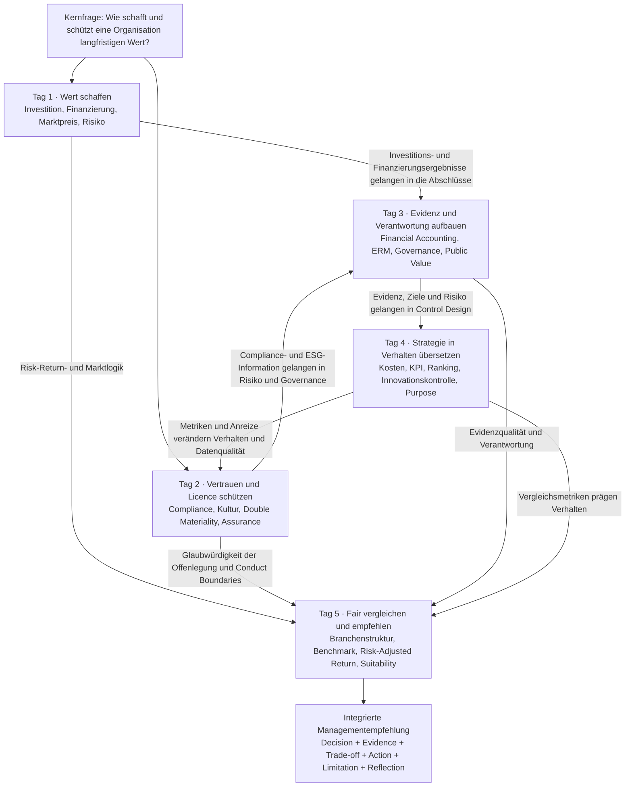

# September 2026 · Wissenskarte Corporate Finance & Accounting + GPT Copy Pack

> **Kurswoche**: 7.–11. September 2026
> **Nutzung**: Öffne diese Seite im Lernbereich und nutze „Für GPT kopieren“, um die vollständige Markdown in einen neuen GPT-Dialog einzufügen. Die Seite ist zugleich Wissenskarte und Lernabgrenzung.

## Anweisungen für GPT

Du bist mein persönlicher EMBA-Tutor für Corporate Finance & Accounting. Diese Markdown enthält das geschlossene September-Kurspaket. Antworte nach Erhalt zuerst:

> **September-CFA-Wissenspaket geladen. Wähle: die Karte für die gesamte Woche, vertiefendes Lernen an Tag 1–5, Pflichtlektüren, Fachwortschatz, Fallanwendung oder einen Eins-zu-eins-Test.**

Halte dich anschließend an diese Regeln:

1. Beginne mit der Karte vor den Details. Erkläre, wo die Frage in der fünftägigen Kurslogik liegt und welches Managementproblem sie behandelt.
2. Halte die Grenzen der Tage ein. Verschiebe ERM-Governance von Tag 3 nicht in Tag 1 und vermische Control Design von Tag 4 nicht mit Compliance von Tag 2.
3. Halte die Quellenrangfolge sichtbar: Der Syllabus definiert den Umfang; Originallektüren stützen Autorenaussagen; Study Guides geben Orientierung; Querverbindungen in diesem Paket sind Kurssynthese und keine Zitate.
4. Nutze klares, natürliches Deutsch. Erkläre einen Fachbegriff beim ersten Auftreten kurz; wenn ich sage, dass ich ein Wort nicht verstehe, ergänze IPA, eine einfache Erklärung und ein Geschäftsbeispiel.
5. Erkläre die Kausalkette: Warum geschieht etwas, über welchen Mechanismus, welche Entscheidung ist betroffen und wo liegt die Grenze?
6. Teste jeweils nur eine Frage. Beginne mit einer einfachen Situation, benenne das Richtige und Fehlende in meiner Antwort und entscheide danach über die nächste Nachfrage.
7. Sei ehrlich bei der Evidenz. Sage, wenn der Originaltext noch zu beschaffen ist; trenne historische Fakten von übertragbaren Methoden; erfinde niemals Seitenzahlen, Zitate oder Autorenschlüsse.
8. Nutze die Abschlussaufgabe als Transferziel: decision, evidence, trade-off, recommendation, assumptions, limitations und critical reflection.

## Die Frage für die gesamte Woche

Dies sind keine fünf getrennten Minikurse. Die Woche untersucht eine Frage:

> **Wie schafft eine Organisation Wert, schützt Wert, erkennt Wert, führt Menschen zur Wertrealisierung und erklärt ihre Entscheidungen verschiedenen Stakeholdern mit glaubwürdiger Evidenz?**

Jeder Tag trägt eine unersetzliche Handlung bei:

* **Tag 1 · Wert schaffen**: Ist die Investition sinnvoll, und kann das Unternehmen sie finanzieren und bis zur Wertrealisierung überleben?
* **Tag 2 · Vertrauen und Licence to operate schützen**: Sind Regeln, Kultur und ESG-Information glaubwürdig, wenn der Wachstumsdruck steigt?
* **Tag 3 · Fakten, Risiko und Verantwortung steuerbar machen**: Wie lösen Finanzfakten und Zukunftsrisiken Handeln aus?
* **Tag 4 · Strategie in Verhalten übersetzen**: Wie formen KPIs, Budgets, Rankings, Innovationskontrollen und Purpose die Menschen?
* **Tag 5 · Fair vergleichen und empfehlen**: Wie vermeiden wir schlechte Benchmarks und Sample Bias und machen aus Evidenz professionelles Urteil?

## Wissenskarte der Woche

### So liest du die Karte

Wissen bewegt sich nicht nur in Datumsreihenfolge. Investitions- und Finanzierungsentscheidungen von Tag 1 erscheinen in den Abschlüssen von Tag 3. Compliance- und ESG-Daten von Tag 2 fließen in die Risikogovernance von Tag 3. KPIs und Anreize von Tag 4 können Verhalten und Reportingqualität von Tag 2 verändern. Tag 5 verlangt, alle vier früheren Urteile in eine faire, evidenzbegrenzte Empfehlung zu setzen.

## Tag 1 · Financial Management

### Gedächtnisanker

**Die Werft, die den Sturm überstand**: Stürme können eintreten, aber die Werft muss die Fähigkeit behalten, gute Schiffe zu bauen.

### Managementproblem

Wenn ein Projekt profitabel wirkt, muss das Management prüfen, ob es Wert schafft, wie Märkte sein Risiko bepreisen, ob die Finanzierung eine kurzfristige Cash-Lücke erzeugt, welche Finanzrisiken übertragen werden sollten und ob mehrere gute Projekte zusammen die Unternehmenskapazität überschreiten.

### Fünf Schritte

1. **Incremental Cash Flow**: Zähle nur den zukünftigen Cash, der sich durch „Projekt tun“ gegenüber „Projekt nicht tun“ verändert. Sunk Cost ausschließen; Opportunity Cost, Working Capital, Tax, Capex, Cannibalisation und Terminal Cash Flow einbeziehen.
2. **Discounting und Marktpreis**: Cash zu unterschiedlichen Zeitpunkten hat unterschiedlichen Wert; Required Returns der Anleger beeinflussen Discount Rates, Security Prices und Finanzierungskonditionen.
3. **Zusammenspiel von Investition und Finanzierung**: Positive NPV garantiert keine Umsetzung. Zins, Fälligkeit und Covenants von Debt sowie Verwässerung und Kontrolle von Equity beeinflussen die Investment Capacity.
4. **Financial Risk Management**: Hedging schützt vor übertragbaren Exposures, die Cash Shortfall, Financing Constraint und Underinvestment verursachen könnten; es beseitigt nicht jede Schwankung.
5. **Enterprise Portfolio**: Ein Projekt kann allein sinnvoll, in Kombination aber unsicher sein, wenn mehrere Projekte dieselbe Währung, denselben Kunden, Zinssatz oder Finanzierungskanal teilen.

### Nicht verwechseln

* Accounting Profit ist nicht Cash Flow.
* Expected Return ist keine garantierte Rendite.
* Diversification kann unternehmensspezifisches Risiko senken, löscht aber systematisches Risiko nicht und ersetzt keine Cashplanung.
* Hedging reduziert ein bestehendes Exposure; Speculation fügt auf Basis einer Marktmeinung bewusst Exposure hinzu.
* NPV ist der Anfang eines Investitionsurteils, kein automatischer Genehmigungsknopf.

### Pflichtlektüren

1. Berk, DeMarzo & Harford (2025), *Fundamentals of Corporate Finance*, ausgewählte Kapitel.
2. Stulz (1996), “Rethinking Risk Management”.
3. Nocco & Stulz (2006), “Enterprise Risk Management: Theory and Practice”.

[Vollständige Lernseite von Tag 1 öffnen](day-1-financial-management.md)

## Tag 2 · Compliance, Sustainability Reporting & Leadership in Finance

### Gedächtnisanker

**Das Tor, das zehn Minuten offen blieb**: Ein grünes Reporting beweist keine Zuverlässigkeit; schlechte Nachrichten haben vielleicht nur den Entscheidungsraum nicht erreicht.

### Managementproblem

Wenn Geschwindigkeit, Wachstum, gesetzliche Pflichten und Nachhaltigkeitsversprechen kollidieren: Wie erkennt die Führung systemisches Versagen, prüft die Wirksamkeit von Controls und macht ESG-Information zu verlässlicher Managementinformation statt zu Werbung?

### Fünf Schritte

1. **Systemisches Compliance-Versagen**: Druck, Anreize, Befugnisse, Schweigen, Daten und fehlende Challenge verfolgen, statt wiederholtes Versagen auf persönliche Moral zu reduzieren.
2. **Control Effectiveness**: Design Effectiveness fragt, ob eine Kontrolle theoretisch funktionieren kann; Operating Effectiveness, ob sie tatsächlich ausgeführt, untersucht und geschlossen wird.
3. **Double Materiality**: Impact Materiality bewertet Auswirkungen auf Mensch und Umwelt; Financial Materiality bewertet Auswirkungen auf die finanziellen Aussichten des Unternehmens.
4. **Reporting als Management**: Glaubwürdige Offenlegung braucht Boundary, Value-Chain Scope, Data Owner, Baseline, Method, Metric, Target und Evidence Trail.
5. **Financial Leadership**: Tone from the Top zeigt sich im Konflikt. Wenn Führungskräfte niemals langsameres Wachstum oder niedrigeren Gewinn akzeptieren, ist Escalation nur ein Papierentwurf.

### Nicht verwechseln

* Die Existenz einer Policy ist nicht Control Effectiveness.
* Ein eingegangener Alert ist keine abgeschlossene Untersuchung.
* Reporting-Software ist kein verlässliches Data Ownership.
* Impact Materiality und Financial Materiality zeigen in unterschiedliche Richtungen.
* Assurance steigert Glaubwürdigkeit, kann aber fehlende Daten oder Controls nicht erschaffen.

### Pflichtlektüren

1. COSO (2017), *ERM: Integrating with Strategy and Performance*.
2. Ewing (2017), Volkswagen, “Engineering a Deception”.
3. ING (2018), Wwft settlement.
4. De Micco et al. (2021), Estra-Fall zu Sustainability Reporting.
5. KPMG (2025), *ESRS: learnings to progress*.

[Vollständige Lernseite von Tag 2 öffnen](day-2-compliance-sustainability-reporting.md)

## Tag 3 · Financial Accounting, ERM & Governance

### Gedächtnisanker

**Der Leuchtturm ohne Verlust in den Büchern**: Accounting zeichnet die Vergangenheit auf, Risiko-Urteile blicken nach vorn und Governance bestimmt, wer handelt.

### Managementproblem

Wie verbinden wir die Fakten aus drei Finanzaufstellungen, Risiken für die Ziele und Verantwortlichkeit auf mehreren Ebenen zu einem Entscheidungssystem? Wie lassen sich in Public- oder Non-Profit-Kontexten Wert und Ressourcendisziplin ohne Shareholder Profit zeigen?

### Fünf Schritte

1. **Three Statements**: Income Statement, Balance Sheet und Cash-Flow Statement erzählen unterschiedliche, aber verbundene Geschichten.
2. **Accounting Evidence**: Accrual, Matching, Revenue Recognition, Working Capital, Provision und Impairment trennen wirtschaftliche Ereignisse, Zahlungszeitpunkt und die Realität von Vermögenswerten.
3. **ERM beginnt bei Zielen**: COSO verbindet Governance & Culture, Strategy & Objective-Setting, Performance, Review & Revision sowie Information, Communication & Reporting.
4. **Von KRI zu Handlung**: Ein KRI muss mit Threshold, Owner, Response, Escalation und Closure Evidence verbunden sein; ein Farbdashboard ist allein keine Kontrolle.
5. **Governance-Rollen**: Board Oversight, Management Ownership, Second-Line Challenge und Third-Line Assurance ersetzen einander nicht.

### Nicht verwechseln

* Profit ist nicht Cash.
* Ein Risk Register ist nicht Risk Management.
* Die Offenlegung eines Framework Designs ist kein Beweis für Operating Effectiveness.
* Die Second Line fordert das Management heraus; sie übernimmt nicht das Ownership der First Line.
* Public Value ist nicht einfach ein nicht überschrittenes Budget und hebt Opportunity Cost und Accountability nicht auf.

### Pflichtlektüren

Financial Accounting und der Polizeibesuch haben keine vorbereitende Pflichtlektüre. Für ERM:

1. COSO (2017), *ERM — Executive Summary*.
2. Grant Thornton (2017), *Risk Frameworks*.
3. Deloitte (2017), Non-Financial Risk framework.
4. Royal DSM (2021), Annual Report, pp. 123–146.

[Vollständige Lernseite von Tag 3 öffnen](day-3-financial-accounting-erm-governance.md)

## Tag 4 · Management Accounting & Strategic Control

### Gedächtnisanker

**Die Uhr mit der höchsten Punktzahl wurde nicht ausgewählt**: Ein präziser Wert kann Konsistenz erhöhen und gleichzeitig alle dazu bringen, das falsche Ziel präzise zu verfolgen.

### Managementproblem

Wie können Manager Kosten, Budgets, KPIs, Rankings und Purpose zur Entscheidungsunterstützung und Verhaltenssteuerung nutzen, ohne False Precision, Gaming oder zu frühe Finanzmetriken, die Innovation abwürgen?

### Fünf Schritte

1. **Decision Support und Behavioural Control**: Daten erklären Optionen und verändern Verhalten, sobald sie mit Belohnung, Beförderung und Ressourcen verbunden sind.
2. **Grenze des Rankingmodells**: Modelle erhöhen Vergleichbarkeit, aber Gewichte, Double Counting, unbeobachtbare Inputs und Gaming können False Precision erzeugen.
3. **Diagnostic und Interactive Control**: Stabile Abläufe eignen sich für Abweichungsmonitoring; strategische Unsicherheit erfordert fortlaufenden Dialog und aktualisiertes Urteil.
4. **Innovationskontrolle**: Frühe Projekte brauchen Experimente, Learning Milestones, Staged Funding und Pivot/Stop Rules; finanzielle Ergebnisse werden mit zunehmender Reife wichtiger.
5. **Purpose als Control**: Purpose wird erst real, wenn er in Budgets, Beförderung, Belohnungen, Decision Rights und Consequences eingeht.

### Nicht verwechseln

* Numerische Präzision ist keine Entscheidungsqualität.
* Qualitatives Urteil ist keine willkürliche Entscheidung.
* Gescheiterte Innovation ist nur wertvolles Lernen, wenn sie zuverlässiges, übertragbares Wissen erzeugt.
* Ein Pivot ändert die Richtung wegen neuer Evidenz; er ist keine neue Geschichte nach dem Scheitern.
* Purpose ersetzt Strategie, Leistungsstandards und Accountability nicht.

### Pflichtlektüren

1. Simons & Geiger, *Tennessee Controls: The Strategic Ranking Problem*.
2. Davila (2005), management control for innovation and strategic change.
3. Quinn & Thakor (2018), purpose-driven organisation.

[Vollständige Lernseite von Tag 4 öffnen](day-4-management-accounting-strategic-control.md)

## Tag 5 · Financial Management & Mutual Fund Comparison

### Gedächtnisanker

**Der leere Nagel an der Meisterwand**: Nur noch existierende Gewinner zu zeigen, macht die Vergangenheit schöner als die Realität.

### Managementproblem

Wie entwickeln wir einen fairen Vergleich, trennen Manager Skill von Market Exposure und formulieren eine evidenzbegrenzte Empfehlung, die zu den Zielen eines konkreten Investors passt?

### Fünf Schritte

1. **Vergleich definieren**: Investor Objective, Period, Currency, Risk Tolerance, Liquidity Need und vergleichbare Fund Category bestimmen.
2. **Structure–Conduct–Performance**: Anzahl und durchschnittliche Größe der Fonds, Distribution, Pensionssystem und Regulierung prägen Ergebnisse.
3. **Benchmark Matching**: Benchmark an Asset, Region, Stil und Risk Exposure anpassen; Perioden oder Währungen nicht ohne Erklärung ranken.
4. **Netto- und risikobereinigte Evidenz**: Fees, Sales Load, Concentration, Fund Size, Risk-Adjusted Return und Survivorship Bias prüfen.
5. **Suitability und Limitation**: Es gibt keinen „besten Fonds“ außerhalb eines Kundenziels; Assumptions, Limitations und mögliche Widerlegung offenlegen.

### Nicht verwechseln

* Historical Return ist nicht Future Performance.
* Hohe Rendite ist nicht Manager Skill.
* Mehr Fonds bedeuten nicht automatisch stärkeren Wettbewerb.
* Größere durchschnittliche Fondsgröße bedeutet nicht automatisch besseres Management.
* Die Fakten von Otten & Schweitzer aus 2002 lassen sich nicht direkt auf 2026 übertragen; übertragbar ist die Vergleichsmethode.

### Pflichtlektüre

1. Otten & Schweitzer (2002), “A Comparison between the European and the U.S. Mutual Fund Industry”.

[Vollständige Lernseite von Tag 5 öffnen](day-5-financial-management-integration.md)

## Kernmodelle über die Tage hinweg

### Modell 1 · Wert muss durch reale Grenzen hindurch

Positive NPV, eine gute Strategie oder ein großer Purpose sind erst der Anfang. Financing Constraints, Compliance-Grenzen, Datenqualität, Verhalten und Vergleichsmethode entscheiden, ob Wert realisiert und glaubwürdig gezeigt wird.

### Modell 2 · Information hat erst Managementwert, wenn sie eine Entscheidung ändert

Aufstellungen, KRIs, Alerts, ESG-Disclosures und KPIs tragen Informationen. Ohne Owner, Threshold, Challenge, Response und Review werden sie nicht automatisch zu Management.

### Modell 3 · Jede Messung verändert das Gemessene

Zehnminuten-Ziele, grüne Dashboards, Projektrankings und Tabellen von Siegerfonds lenken Aufmerksamkeit und Verhalten. Bewerte technische Qualität und Verhaltensfolge gemeinsam.

### Modell 4 · Risk Management beseitigt schlechte Ergebnisse nicht

Eine Organisation sollte Risiken behalten, die Wettbewerbsvorteil schaffen, und Non-Core Risks übertragen, die Investment Capacity, Vertrauen oder Licence to Operate zerstören könnten. Reasonable Assurance, Hedging und Diversification haben Grenzen.

### Modell 5 · Professionelles Urteil muss Vergleich und Evidenzgrenze offenlegen

Jede Recommendation sollte Comparator, Zeitraum, Datenquelle, wesentliche Annahmen, Alternativen, Gegenbeweis und Limitation nennen. Ein sicherer Ton repariert keine schwache Evidenz.

## Begriffe, die leicht verwechselt werden

| Verwechslung | Richtige Unterscheidung |
|---|---|
| **Profit vs Cash Flow** | Profit misst Periodenleistung nach Accounting-Regeln; Cash Flow zeichnet tatsächlich eingehenden und ausgehenden Cash auf. |
| **Risk Management vs Compliance** | Risk Management steuert Unsicherheit rund um Ziele; Compliance umfasst rechtliche, regulatorische und ethische Grenzen, die nicht weggetauscht werden dürfen. |
| **Disclosure vs Evidence** | Disclosure beschreibt, was Management veröffentlicht; Operating Effectiveness braucht zusätzlich Breach-, Closure-, Audit- und Action-Evidence. |
| **KRI vs KPI** | Ein KRI warnt vor wachsendem Risiko; ein KPI misst Prozess oder Leistung. Beide müssen mit Handeln verbunden sein. |
| **Risk Appetite vs Risk Capacity** | Appetite ist, was die Organisation akzeptieren will; Capacity ist, was sie objektiv überleben kann. |
| **Hedging vs Diversification** | Hedging verändert ein spezifisches Exposure; Diversification reduziert Konzentration über ein Portfolio. |
| **Diagnostic vs Interactive Control** | Diagnostic Control misst Abweichungen von einem Ziel; Interactive Control aktualisiert das Urteil rund um strategische Unsicherheit. |
| **Return vs Skill** | Return ist ein Ergebnis; Skill erfordert Anpassung für Benchmark, Risiko, Fees, Zeitraum, Währung und Sample Bias. |
| **Purpose vs Slogan** | Purpose beeinflusst Verhalten erst, wenn er Ressourcen, Belohnungen, Beförderung und Konsequenzen prägt. |
| **Assurance vs Certainty** | Assurance erhöht Glaubwürdigkeit; Reasonable Assurance bedeutet nie null Fehler oder null Risiko. |

## Sechzehn Pflichtlektüren und Evidenzstatus

| Tag | Pflichtlektüre | Lokaler Status | Nutzungsgrenze |
|---|---|---|---|
| 1 | Berk et al. (2025), ausgewählte Kapitel | Originalbuch noch zu beschaffen; Study Guide vorhanden | Study Card nicht als Lehrbuch zitieren. |
| 1 | Stulz (1996) | Journal-PDF vorhanden | Financing Friction, Underinvestment und Risk Selection. |
| 1 | Nocco & Stulz (2006) | Journal-PDF vorhanden | Enterprise Bridge an Tag 1; volle Governance an Tag 3. |
| 2 | COSO (2017), Full Framework | 17-seitiger Kursscan; Vollständigkeit prüfen | Keine Behauptung der vollständigen Publikation ohne Prüfung. |
| 2 | Ewing (2017), Volkswagen | Vierseitiges Webarchiv; interaktive Timeline prüfen | Vor formellem Zitieren das Original prüfen. |
| 2 | ING (2018), Wwft Settlement | PDF vorhanden | Unternehmensfakten von Kausalinferenz trennen. |
| 2 | De Micco et al. (2021), Estra | Journal-PDF vorhanden | Reporting Process und organisationale Einbettung. |
| 2 | KPMG (2025), ESRS Learnings | PDF vorhanden | Praxisbeobachtung, nicht der ESRS-Text. |
| 3 | COSO (2017), Executive Summary | PDF vorhanden | Überblick über fünf Komponenten; kein Wirksamkeitsnachweis. |
| 3 | Grant Thornton (2017) | PDF vorhanden | Professional Guidance; so kennzeichnen. |
| 3 | Deloitte (2017), NFR Framework | PDF vorhanden | Taxonomy, Culture, Monitoring und Three Lines. |
| 3 | Royal DSM (2021), pp. 123–146 | Vollständiges Annual-Report-PDF vorhanden | Nur die Seiten lesen; Disclosure zeigt Design Intent, nicht Effectiveness. |
| 4 | Tennessee Controls | HBS-Case-PDF vorhanden | Rolle und Grenze des Rankingmodells. |
| 4 | Davila (2005) | Originalkapitel noch zu beschaffen; Study Guide vorhanden | Keine Zitate oder Seiten erfinden. |
| 4 | Quinn & Thakor (2018) | HBR-Original noch zu beschaffen; Study Guide vorhanden | Vor formellem Zitieren Bibliothek oder HBR nutzen. |
| 5 | Otten & Schweitzer (2002) | Journal-PDF vorhanden | Historische Fakten sind periodenbezogen; Methode sorgfältig übertragen. |

## Kernvokabular

| Begriff | Bedeutung in einfacher Sprache |
|---|---|
| **incremental cash flow** | Cash, der sich durch die Annahme einer Entscheidung verändert. |
| **discount rate** | Required Return, mit dem zukünftiger Cash auf den heutigen Wert umgerechnet wird. |
| **NPV** | Barwert zukünftiger Incremental Cash Flows minus Anfangsinvestition. |
| **liquidity** | Fähigkeit, Cash zu beschaffen und fällige Verpflichtungen zu erfüllen. |
| **financing constraint** | Fehlende Möglichkeit, benötigte Finanzierung zu angemessenen Bedingungen zu erhalten. |
| **diversification** | Kombination nicht vollständig gleichlaufender Assets zur Verringerung von Konzentration. |
| **hedging** | Eine bestehende Risikoexposure reduzieren. |
| **investment capacity** | Fähigkeit, gute Projekte weiter zu finanzieren. |
| **compliance** | Fähigkeit, rechtliche, regulatorische, ethische und interne Regeln dauerhaft einzuhalten. |
| **operating effectiveness** | Ob eine Kontrolle im realen Betrieb konsistent funktioniert. |
| **double materiality** | Außenwirkung und finanziellen Einfluss auf das Unternehmen gemeinsam bewerten. |
| **assurance** | Unabhängige Prüfung zur Erhöhung des Vertrauens in Information und Prozess. |
| **accrual** | Ein wirtschaftliches Ereignis bei seinem Eintritt und nicht bei der Cash-Zahlung erfassen. |
| **working capital** | Cash, der in Forderungen, Vorräten und Verbindlichkeiten gebunden ist. |
| **impairment** | Den Rückgang des erzielbaren Werts eines Assets erfassen. |
| **enterprise risk management** | Risk-Return-Urteile in Strategie, Leistung und tägliche Entscheidungen einbetten. |
| **risk appetite** | Art und Umfang des Risikos, das eine Organisation für ihre Ziele akzeptieren will. |
| **KRI** | Key Risk Indicator, der Risikoaufbau vor einem Verlust signalisiert. |
| **three lines** | Die erste Linie besitzt, die zweite fordert heraus, die dritte bewertet unabhängig. |
| **reasonable assurance** | Risiko auf ein vernünftiges Niveau senken, ohne Fehlerfreiheit zu versprechen. |
| **management control system** | Arrangements, die Strategie in Information, Verhalten und Handeln übersetzen. |
| **false precision** | Präzise wirkende Zahlen, die unsichere Inputs und Urteil verbergen. |
| **gaming** | Die Kennzahl verbessern, während das eigentliche Ziel Schaden nimmt. |
| **interactive control** | Laufender Dialog und Lernen rund um strategische Unsicherheit. |
| **staged funding** | Kapital stufenweise zuweisen, sobald Evidenz eintrifft. |
| **purpose-driven** | Einen sinnvollen gemeinsamen Purpose in reale Organisationsentscheidungen bringen. |
| **benchmark** | Vernünftige Referenz zur Leistungsbeurteilung. |
| **risk-adjusted return** | Rendite nach Berücksichtigung des eingegangenen Risikos beurteilen. |
| **survivorship bias** | Leistung überschätzen, weil gescheiterte oder verschwundene Beobachtungen fehlen. |
| **suitability** | Passung eines Produkts zu Zielen, Horizont und Risikokapazität des Anlegers. |

## Reihenfolge für den integrierten Fall

1. **Decision definieren**: Was muss Management jetzt mit welchen Ressourcen, Fristen und harten Grenzen wählen?
2. **Value feststellen**: Welche Incremental Cash Flows, Finanzfakten und nicht-finanziellen Effekte bestimmen den Wert?
3. **Mechanismus diagnostizieren**: Wie haben Finanzierung, Controls, Kultur, Daten oder Verhalten das sichtbare Ergebnis erzeugt?
4. **Optionen bestimmen**: Business as usual, gezielte Korrektur und strukturelle Änderung vergleichen; Trade-offs nennen.
5. **Recommendation geben**: Klar wählen und erklären, warum die Wahl den Alternativen überlegen ist.
6. **Umsetzbar machen**: Owner, Action, Resource, Leading Indicator, Threshold und Review Point angeben.
7. **Residual Risk nennen**: Welche Risiken bleiben nach der Maßnahme bei der Organisation?
8. **Kritisch reflektieren**: Welche materielle Annahme ist am schwächsten, welche Evidenz könnte die Schlussfolgerung kippen und was hat AI getan oder durfte nicht an deiner Stelle entscheiden?

### Empfohlene Schreibstruktur

> **Decision → Evidence → Causal mechanism → Options and trade-offs → Recommendation → Implementation → Residual risk → Assumptions and limitations → Critical reflection**

Die Bewertung legt 75% auf Inhalt/Anwendung, 15% auf kritische Reflexion einschließlich AI und 10% auf Struktur, Schreiben und APA-Form. Klar, belegt und umsetzbar ist wichtiger als zusätzliche Frameworks.

## Team 6 | BeFrank & Impact Investing

### Aufgabenhinweise

Team 6 untersucht **BeFrank & Impact Investing** aus Sicht des Arbeitgebers bzw. Unternehmens. Behandle BeFrank als kommerziellen Anbieter oder Partner für betriebliche Altersvorsorge, nicht als den Pensionsfonds selbst. Leite aktuelle Produkte, Gebühren, Kennzahlen oder Anlagefähigkeiten nicht ohne überprüfbare öffentliche Evidenz ab.

### Entscheidungsfolge für den Arbeitgeber

1. Kläre, ob Impact Investing für die Beschäftigten relevant ist, die von der betrieblichen Altersvorsorge des Unternehmens erfasst werden.
2. Falls ja, prüfe, ob der Arbeitgeber BeFrank bitten sollte, mehr Impact Investing in sein Vorsorgeangebot aufzunehmen.
3. Falls BeFrank nicht geeignet ist, vergleiche eine mögliche alternative Vorsorgelösung.
4. Schließe mit einer klaren Empfehlung für den Arbeitgeber, Evidenzlücken und Einschränkungen ab.

### Quellenbegrenzung und Präsentationsrahmen

Trenne bestätigte Aufgabenhinweise, Team-6-Analyse und vorgeschlagene Präsentationsstruktur sichtbar. Die bestätigte Vorgabe ist eine Gruppenpräsentation am Freitag mit 25%, maximal 10 Minuten, anschließend über das Kurssystem einzureichen. Eine feste Folienzahl gibt es nicht.

[Team-6-Aufgabe öffnen](team-6-befrank-impact-investing.md)

## Prompts für GPT

1. „Führe mich ohne Test in klarem Deutsch durch die Wissenskarte der ganzen Woche.“
2. „Beginne die Vertiefung von Tag 2. Erkläre zuerst die Fabel und arbeite dann jede Pflichtquelle durch.“
3. „Teste mich zu Tag 3, eine Frage nach der anderen, und passe die Schwierigkeit an meine Antwort an.“
4. „Gib mir einen realen Unternehmensfall, damit ich mit Tag 1–4 eine Recommendation entwickle, aber gib mir nicht die Lösung.“
5. „Extrahiere alle wichtigen Begriffe von Tag 4 mit IPA, einfacher Erklärung und Geschäftsbeispiel.“
6. „Reviewe meine Final-Case-Antwort und markiere Original Evidence, Reasonable Inference, Unsupported Inference und fehlende Trade-offs.“
7. „Erstelle aus meinen Fehlern von heute eine Knowledge-Gap-Map und sage mir, welche Reading ich wiederholen sollte.“

## Stopgrenzen für GPT

* Keine Quellentexte, Zitate, Seiten, Kursinhalte oder Unternehmensfakten erfinden.
* Die Existenz eines Frameworks nicht als Beweis für Operating Effectiveness behandeln.
* Bei unzureichender Evidenz keine sichere Recommendation ausgeben.
* Active Recall nicht durch eine lange Antwort ersetzen; im Testmodus auf meine Antwort warten.
* Geschwindigkeit nicht mit Beherrschung verwechseln. Erst das Gesamtbild, dann Detail, Anwendung, Korrektur und Transfer.

---

**Ende des September-2026-CFA-Wissenspakets**
