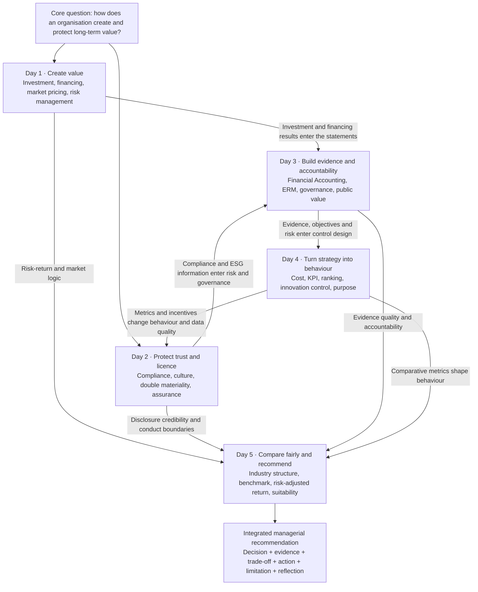

# September 2026 · Corporate Finance & Accounting Knowledge Map + GPT Pack

> **Course week**: 7–11 September 2026
> **How to use this page**: Open it in the hub and use “Copy for GPT” to paste the complete Markdown into a new GPT conversation. It is both a knowledge map and a boundary for guided study.

## Instructions for GPT

You are my private EMBA tutor for Corporate Finance & Accounting. This Markdown is the closed September course pack. After receiving the full text, reply first:

> **September CFA knowledge pack loaded. Choose: the full-week map, deep study of Day 1–5, assigned readings, vocabulary, case application, or a one-to-one test.**

Then follow these rules:

1. Start with the map before the detail. Explain where the question sits in the five-day course and which management problem it addresses.
2. Keep the syllabus boundaries by day. Do not move Day 3 ERM governance into Day 1 or mix Day 4 control design with Day 2 compliance.
3. Keep source priority clear: the syllabus defines scope; original readings support author claims; study guides navigate; cross-reading connections in this pack are course synthesis, not quotations.
4. Use plain English. When a professional term first appears, give a short explanation; when I say “I do not understand this word”, add IPA, a plain explanation and a business example.
5. Explain the causal chain: why something happens, through which mechanism, which decision it affects, and where the boundary lies.
6. Test one question at a time. Start with a simple scenario, identify what is correct and missing in my answer, then decide whether to probe further.
7. Be honest about evidence. Say “source text still to obtain” where appropriate; distinguish historical facts from transferable methods; never invent pages, quotations or author conclusions.
8. Use the final assignment as the transfer goal: decision, evidence, trade-off, recommendation, assumptions, limitations and critical reflection.

## The question for the whole week

This is not five unrelated mini-courses. It studies one question:

> **How does an organisation create value, protect value, see value, guide people to realise value, and explain its decisions to different stakeholders with credible evidence?**

The five days contribute one non-substitutable action each:

* **Day 1 · Create value**: Is the investment worth doing, and can the company finance and survive until value is realised?
* **Day 2 · Protect licence and trust**: Are rules, culture and ESG information credible when growth pressure rises?
* **Day 3 · Make facts, risk and accountability governable**: How do financial facts and future risks trigger action?
* **Day 4 · Turn strategy into behaviour**: How do KPIs, budgets, rankings, innovation controls and purpose shape people?
* **Day 5 · Compare fairly and recommend**: How do we avoid poor benchmarks and sample bias and turn evidence into professional judgement?

## One-week knowledge map

### How to read the map

Knowledge does not move only in date order. Day 1 investment and financing decisions enter Day 3 financial statements. Day 2 compliance and ESG data enter Day 3 risk governance. Day 4 KPIs and incentives can change Day 2 behaviour and reporting quality. Day 5 asks you to place all four earlier judgements inside one fair, evidence-limited recommendation.

## Day 1 · Financial Management

### Memory anchor

**The shipyard that survived the storm**: storms can happen, but the shipyard must retain the ability to build good ships.

### Management problem

When a project appears profitable, management must ask whether it creates value, how markets price its risk, whether financing creates a short-term cash break, which financial risks should be transferred, and whether several good projects together exceed enterprise capacity.

### Five-step logic

1. **Incremental cash flow**: count only future cash changed by doing the project rather than not doing it. Exclude sunk cost; include opportunity cost, working capital, tax, capex, cannibalisation and terminal cash flow.
2. **Discounting and market pricing**: cash at different dates has different value; investor required returns affect discount rates, security prices and financing terms.
3. **Investment–financing interaction**: positive NPV does not guarantee completion. Debt interest, maturity and covenants, or equity dilution and control, affect investment capacity.
4. **Financial risk management**: hedging protects against transferable exposure that could cause cash shortfall, financing constraint and underinvestment; it is not a promise to remove every fluctuation.
5. **Enterprise portfolio**: a project can be reasonable alone but unsafe in combination when projects share a currency, customer, rate or funding channel.

### Keep separate

* Accounting profit is not cash flow.
* Expected return is not guaranteed return.
* Diversification can reduce company-specific risk but does not erase systematic risk or replace cash planning.
* Hedging reduces existing exposure; speculation deliberately adds exposure based on a market view.
* NPV is the start of an investment judgement, not an automatic approval button.

### Assigned readings

1. Berk, DeMarzo & Harford (2025), *Fundamentals of Corporate Finance*, assigned chapters.
2. Stulz (1996), “Rethinking Risk Management”.
3. Nocco & Stulz (2006), “Enterprise Risk Management: Theory and Practice”.

[Open the complete Day 1 learning page](day-1-financial-management.md)

## Day 2 · Compliance, Sustainability Reporting & Leadership in Finance

### Memory anchor

**The gate that stayed open for ten minutes**: a green report does not prove reliability; bad news may simply not have reached the room where decisions are made.

### Management problem

When speed, growth, legal duties and sustainability promises conflict, how can leaders detect systemic failure, test whether controls operate, and make ESG information credible management information rather than promotion?

### Five-step logic

1. **Systemic compliance failure**: trace pressure, incentives, authority, silence, data and failed challenge rather than reducing repeated failure to personal morality.
2. **Control effectiveness**: design effectiveness asks whether a control could work in theory; operating effectiveness asks whether it is executed, investigated and closed in reality.
3. **Double materiality**: impact materiality assesses effects on people and the environment; financial materiality assesses effects on the company’s financial prospects.
4. **Reporting as management**: credible disclosure needs boundary, value-chain scope, data owner, baseline, method, metric, target and evidence trail.
5. **Financial leadership**: tone from the top is visible in conflict. If leaders never accept slower growth or lower profit, escalation is only a paper design.

### Keep separate

* Policy existence is not control effectiveness.
* An alert received is not an investigation completed.
* Reporting software is not reliable data ownership.
* Impact materiality and financial materiality run in different directions.
* Assurance increases credibility but cannot create missing data or controls.

### Assigned readings

1. COSO (2017), *ERM: Integrating with Strategy and Performance*.
2. Ewing (2017), Volkswagen, “Engineering a Deception”.
3. ING (2018), Wwft settlement.
4. De Micco et al. (2021), Estra sustainability-reporting case.
5. KPMG (2025), *ESRS: learnings to progress*.

[Open the complete Day 2 learning page](day-2-compliance-sustainability-reporting.md)

## Day 3 · Financial Accounting, ERM & Governance

### Memory anchor

**The lighthouse with no loss on its books**: accounting records the past, risk judgement faces the future, and governance determines who must act.

### Management problem

How do we connect the facts in three financial statements, risks that could block objectives, and accountability at different levels into one decision system? In a public or non-profit context, how can value and resource discipline be demonstrated without shareholder profit?

### Five-step logic

1. **Three statements**: the income statement, balance sheet and cash-flow statement tell different but connected stories.
2. **Accounting evidence**: accrual, matching, revenue recognition, working capital, provision and impairment distinguish economic events, payment timing and asset reality.
3. **ERM begins with objectives**: COSO connects Governance & Culture, Strategy & Objective-Setting, Performance, Review & Revision, and Information, Communication & Reporting.
4. **KRI to action**: a KRI must connect to a threshold, owner, response, escalation and closure evidence; a colour dashboard is not a control by itself.
5. **Governance roles**: board oversight, management ownership, second-line challenge and third-line assurance cannot replace one another.

### Keep separate

* Profit is not cash.
* A risk register is not risk management.
* Disclosure of framework design is not evidence of operating effectiveness.
* The second line challenges management; it does not take over first-line ownership.
* Public value is not simply an underspent budget and does not remove opportunity cost or accountability.

### Assigned readings

Financial Accounting and the police visit have no assigned preparatory reading. ERM readings are:

1. COSO (2017), *ERM — Executive Summary*.
2. Grant Thornton (2017), *Risk Frameworks*.
3. Deloitte (2017), Non-Financial Risk framework.
4. Royal DSM (2021), Annual Report, pp. 123–146.

[Open the complete Day 3 learning page](day-3-financial-accounting-erm-governance.md)

## Day 4 · Management Accounting & Strategic Control

### Memory anchor

**The highest-scoring clock was not selected**: a precise score can improve consistency while making everyone pursue the wrong objective precisely.

### Management problem

How can managers use cost, budgets, KPIs, rankings and purpose to support decisions and guide behaviour without false precision, gaming or mature-business metrics killing innovation too early?

### Five-step logic

1. **Decision support and behavioural control**: data explains options and changes behaviour when tied to rewards, promotion and resources.
2. **Ranking-model boundary**: models improve comparability, but weights, double counting, unobservable inputs and gaming can create false precision.
3. **Diagnostic and interactive control**: stable operations suit variance monitoring; strategic uncertainty requires continuing dialogue and updated judgement.
4. **Innovation control**: early projects need experiments, learning milestones, staged funding and pivot/stop rules; financial outcomes matter more as the project matures.
5. **Purpose as control**: purpose becomes real only when it enters budgets, promotion, rewards, decision rights and consequences.

### Keep separate

* Numeric precision is not decision quality.
* Qualitative judgement is not an arbitrary decision.
* Innovation failure is valuable only when it produces reliable, transferable learning.
* A pivot changes direction because of new evidence; it is not a new story after failure.
* Purpose cannot replace strategy, performance standards or accountability.

### Assigned readings

1. Simons & Geiger, *Tennessee Controls: The Strategic Ranking Problem*.
2. Davila (2005), management control for innovation and strategic change.
3. Quinn & Thakor (2018), purpose-driven organisation.

[Open the complete Day 4 learning page](day-4-management-accounting-strategic-control.md)

## Day 5 · Financial Management & Mutual Fund Comparison

### Memory anchor

**The empty nail on the champions’ wall**: showing only winners that still exist makes history look better than the real world.

### Management problem

How can we build a fair comparison, separate manager skill from market exposure, and make an evidence-limited recommendation that fits a specific investor’s objectives?

### Five-step logic

1. **Define the comparison**: identify investor objective, period, currency, risk tolerance, liquidity need and comparable fund category.
2. **Structure–Conduct–Performance**: fund count, average size, distribution, pension system and regulation shape industry outcomes.
3. **Benchmark matching**: match the benchmark to asset, region, style and risk exposure; do not rank periods or currencies without explanation.
4. **Net and risk-adjusted evidence**: test fees, sales load, concentration, fund size, risk-adjusted return and survivorship bias.
5. **Suitability and limitation**: there is no “best fund” outside a client objective; disclose assumptions, limitations and what could overturn the conclusion.

### Keep separate

* Historical return is not future performance.
* High return is not manager skill.
* More funds are not automatically stronger competition.
* Larger average fund size is not automatically better management.
* Otten & Schweitzer’s 2002 facts cannot be projected directly to 2026; the transferable element is the comparison method.

### Assigned reading

1. Otten & Schweitzer (2002), “A Comparison between the European and the U.S. Mutual Fund Industry”.

[Open the complete Day 5 learning page](day-5-financial-management-integration.md)

## Cross-day core models

### Model 1 · Value must pass through real constraints

Positive NPV, a good strategy or a grand purpose is only a beginning. Financing constraints, compliance boundaries, data quality, behaviour and comparison method determine whether value is realised and credibly demonstrated.

### Model 2 · Information creates management value only when it changes a decision

Statements, KRIs, alerts, ESG disclosures and KPIs are information carriers. Without an owner, threshold, challenge, response and review, they do not become management automatically.

### Model 3 · Every measure changes the measured

Ten-minute service targets, green dashboards, project rankings and champion-fund tables direct attention and behaviour. Evaluate both technical quality and behavioural consequence.

### Model 4 · Risk management does not eliminate bad outcomes

An organisation should retain risks that create competitive advantage and transfer non-core risks that could destroy investment capacity, trust or licence to operate. Reasonable assurance, hedging and diversification all have boundaries.

### Model 5 · Professional judgement must expose its comparison and evidence boundary

Every recommendation should state its comparator, period, data source, material assumptions, alternatives, counter-evidence and limitation. Confidence of tone cannot repair weak evidence.

## Concepts most easily confused

| Confusion | Correct distinction |
|---|---|
| **Profit vs cash flow** | Profit measures period performance under accounting rules; cash flow records actual cash in and out. |
| **Risk management vs compliance** | Risk management manages uncertainty affecting objectives; compliance includes legal, regulatory and ethical boundaries that management cannot trade away. |
| **Disclosure vs evidence** | Disclosure describes what management chooses to publish; operating effectiveness also needs breach, closure, audit and action evidence. |
| **KRI vs KPI** | A KRI warns that risk is accumulating; a KPI measures process or performance. Both must connect to action. |
| **Risk appetite vs risk capacity** | Appetite is what the organisation is willing to accept; capacity is what it can objectively survive. |
| **Hedging vs diversification** | Hedging changes a specific exposure; diversification reduces concentration through a portfolio. |
| **Diagnostic vs interactive control** | Diagnostic control monitors variance from a set target; interactive control keeps updating judgement around strategic uncertainty. |
| **Return vs skill** | Return is an outcome; skill requires careful adjustment for benchmark, risk, fees, period, currency and sample bias. |
| **Purpose vs slogan** | Purpose affects behaviour only when it enters resources, rewards, promotion and consequences. |
| **Assurance vs certainty** | Assurance raises credibility; reasonable assurance never means no error or no risk. |

## Sixteen assigned readings and evidence status

| Day | Assigned reading | Local status | Use boundary |
|---|---|---|---|
| 1 | Berk et al. (2025), assigned chapters | Original book still to obtain; study guide available | Do not cite the study card as the textbook. |
| 1 | Stulz (1996) | Journal PDF available | Financing friction, underinvestment and risk selection. |
| 1 | Nocco & Stulz (2006) | Journal PDF available | Day 1 enterprise bridge; full governance on Day 3. |
| 2 | COSO (2017), full framework | 17-page class scan; completeness to verify | Do not claim the full publication without checking it. |
| 2 | Ewing (2017), Volkswagen | Four-page web archive; interactive timeline to verify | Check the original before formal citation. |
| 2 | ING (2018), Wwft settlement | PDF available | Separate company facts from causal inference. |
| 2 | De Micco et al. (2021), Estra | Journal PDF available | Reporting process and organisational embedding. |
| 2 | KPMG (2025), ESRS learnings | PDF available | Practice observation, not the ESRS text. |
| 3 | COSO (2017), Executive Summary | PDF available | Five-component overview; not proof of effectiveness. |
| 3 | Grant Thornton (2017) | PDF available | Professional guidance; label it as such. |
| 3 | Deloitte (2017), NFR framework | PDF available | Taxonomy, culture, monitoring and three lines. |
| 3 | Royal DSM (2021), pp. 123–146 | Complete annual-report PDF available | Read only the assigned pages; disclosure shows design intent, not effectiveness. |
| 4 | Tennessee Controls | HBS case PDF available | Ranking-model role and boundary. |
| 4 | Davila (2005) | Original chapter still to obtain; study guide available | Do not invent quotations or pages. |
| 4 | Quinn & Thakor (2018) | HBR original still to obtain; study guide available | Obtain it from the library or HBR before formal citation. |
| 5 | Otten & Schweitzer (2002) | Journal PDF available | Historical facts are period-specific; transfer the method carefully. |

## Core vocabulary

| Term | Plain-English meaning |
|---|---|
| **incremental cash flow** | Cash changed by accepting a decision. |
| **discount rate** | Required return used to convert future cash into today’s value. |
| **NPV** | Present value of future incremental cash flow minus initial investment. |
| **liquidity** | Ability to obtain cash and meet obligations when due. |
| **financing constraint** | Inability to obtain needed funding on reasonable terms. |
| **diversification** | Combining imperfectly correlated assets to reduce concentration. |
| **hedging** | Reducing an existing risk exposure. |
| **investment capacity** | Ability to keep funding good projects. |
| **compliance** | Capability to keep meeting legal, regulatory, ethical and internal rules. |
| **operating effectiveness** | Whether a control works consistently in real operations. |
| **double materiality** | Assessing both outward impact and financial impact on the company. |
| **assurance** | Independent checking that raises trust in information and process. |
| **accrual** | Recording an economic event when it occurs rather than when cash moves. |
| **working capital** | Net cash tied up in receivables, inventory and payables. |
| **impairment** | Recognition that an asset’s recoverable value has fallen. |
| **enterprise risk management** | Embedding risk–return judgement into strategy, performance and daily decisions. |
| **risk appetite** | Types and amount of risk an organisation is willing to accept to pursue its objectives. |
| **KRI** | Key Risk Indicator that warns of accumulating risk before loss. |
| **three lines** | First line owns, second line challenges, third line independently evaluates. |
| **reasonable assurance** | Risk reduction to a reasonable level, never a promise of perfection. |
| **management control system** | Arrangements that turn strategy into information, behaviour and action. |
| **false precision** | Exact-looking numbers that hide uncertain inputs and judgement. |
| **gaming** | Improving the metric while damaging the real objective. |
| **interactive control** | Continuing discussion and learning around strategic uncertainty. |
| **staged funding** | Allocating capital step by step as evidence arrives. |
| **purpose-driven** | Bringing a meaningful shared purpose into real organisational choices. |
| **benchmark** | A reasonable reference for judging performance. |
| **risk-adjusted return** | Return assessed after considering the risk taken. |
| **survivorship bias** | Overstating performance by excluding failed or disappeared observations. |
| **suitability** | Fit between a product and an investor’s objectives, horizon and risk capacity. |

## Integrated-case sequence

1. **Define the decision**: what must management choose now, with what time, resources and non-negotiable boundaries?
2. **Establish value**: which incremental cash flows, financial facts and non-financial effects determine value?
3. **Diagnose the mechanism**: how did financing, controls, culture, data or behaviour produce the visible result?
4. **Identify options**: compare business as usual, a targeted correction and structural change; state each trade-off.
5. **Recommend**: choose clearly and explain why it beats the alternatives.
6. **Make it executable**: specify owner, action, resource, leading indicator, threshold and review point.
7. **State residual risk**: which risks remain with the organisation after the intervention?
8. **Reflect critically**: which material assumption is weakest, what evidence could overturn the conclusion, and what did AI do or not have authority to decide?

### Recommended writing spine

> **Decision → Evidence → Causal mechanism → Options and trade-offs → Recommendation → Implementation → Residual risk → Assumptions and limitations → Critical reflection**

The marking emphasis is content/application 75%, critical reflection including AI use 15%, and structure, writing and APA form 10%. Clear, evidenced and executable beats a pile of extra frameworks.

## Team 6 | BeFrank & Impact Investing

### Assignment guidance

Team 6 researches **BeFrank & Impact Investing** from the employer/company perspective. Treat BeFrank as a commercial pension provider or partner, not as the pension fund itself. Do not infer current products, fees, metrics or investment capabilities without checkable public evidence.

### Employer decision sequence

1. Establish whether Impact Investing is relevant to the employees covered by the company’s pension arrangement.
2. If it is relevant, assess whether the employer should ask BeFrank to incorporate more Impact Investing into its pension offering.
3. If BeFrank is not suitable, compare what alternative pension arrangement could be considered.
4. End with a clear employer recommendation, evidence gaps and limitations.

### Source boundary and presentation frame

Keep confirmed assignment guidance, Team 6 analysis and suggested presentation structure visibly separate. The confirmed requirement is a Friday group presentation worth 25%, with a maximum of 10 minutes, followed by submission through the course system. There is no fixed slide count.

[Open the Team 6 assignment](team-6-befrank-impact-investing.md)

## Prompts to send to GPT

1. “Walk me through the whole-week knowledge map in plain English without testing me.”
2. “Enter deep-study Day 2. Explain the fable first, then work through each assigned source.”
3. “Test me on Day 3, one question at a time, adjusting difficulty to my answer.”
4. “Give me a real company case so I can form a Day 1–4 recommendation, but do not give me the answer.”
5. “Extract all key Day 4 terms with IPA, a plain explanation and a business example.”
6. “Review my final-case answer and label original evidence, reasonable inference, unsupported inference and missing trade-offs.”
7. “Turn my mistakes today into a knowledge-gap map and tell me which reading to revisit.”

## GPT stopping boundaries

* Do not invent source text, quotations, pages, class content or company facts.
* Do not treat a framework’s existence as proof of operating effectiveness.
* Do not produce a confident recommendation when evidence is insufficient.
* Do not replace active recall with a long answer; in test mode, wait for my response.
* Do not confuse speed with mastery. Build the whole picture, then add detail, application, correction and transfer.

---

**End of September 2026 CFA Knowledge Pack**
