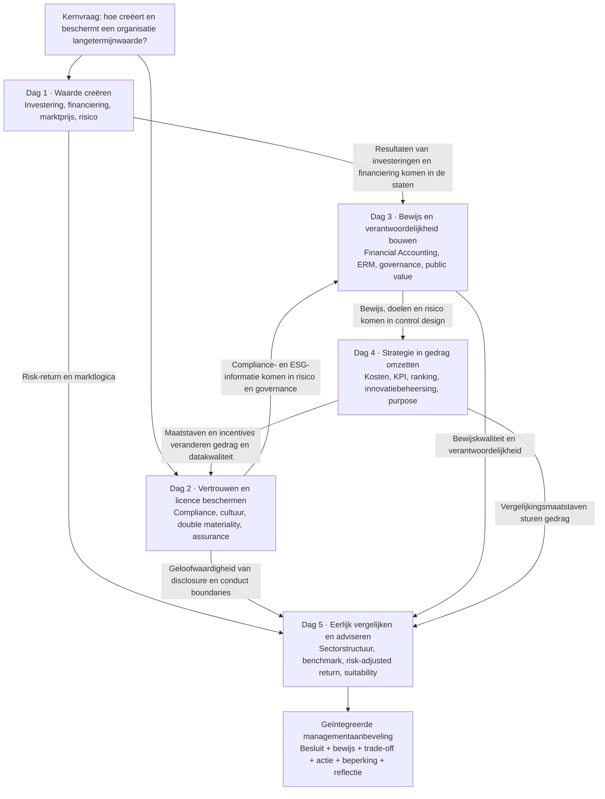

# September 2026 · Kenniskaart Corporate Finance & Accounting + GPT Copy Pack

> **Cursusweek**: 7–11 september 2026
> **Gebruik**: Open deze pagina in de leeromgeving en gebruik “Kopiëren voor GPT” om de volledige Markdown in een nieuw GPT-gesprek te plakken. Dit is zowel een kenniskaart als een afbakening voor begeleid studeren.

## Instructies voor GPT

Je bent mijn persoonlijke EMBA-tutor voor Corporate Finance & Accounting. Deze Markdown is het gesloten cursusmateriaal voor september. Antwoord na ontvangst eerst:

> **September CFA-kennispakket geladen. Kies: de kaart voor de hele week, verdieping van dag 1–5, verplichte readings, vaktaal, case-toepassing of een één-op-één toets.**

Volg daarna deze regels:

1. Begin met de kaart voordat je de details uitlegt. Leg uit waar de vraag in de vijfdaagse cursus zit en welk managementprobleem centraal staat.
2. Houd de grenzen per dag aan. Plaats ERM-governance van dag 3 niet in dag 1 en vermeng control design van dag 4 niet met compliance van dag 2.
3. Houd de bronhiërarchie helder: de syllabus bepaalt de scope; originele readings ondersteunen auteursclaims; study guides geven de route; verbanden tussen readings in dit pakket zijn cursussynthese en geen citaten.
4. Gebruik natuurlijk, helder Nederlands. Geef bij een vakterm de eerste keer een korte uitleg; als ik zeg dat ik een woord niet begrijp, voeg dan IPA, een eenvoudige uitleg en een businessvoorbeeld toe.
5. Leg de causale keten uit: waarom gebeurt iets, via welk mechanisme, welke beslissing wordt geraakt en waar ligt de grens?
6. Toets één vraag tegelijk. Begin met een eenvoudige situatie, benoem wat in mijn antwoord klopt en ontbreekt en bepaal daarna of je verder doorvraagt.
7. Wees eerlijk over bewijs. Zeg wanneer de originele tekst nog moet worden verkregen; scheid historische feiten van overdraagbare methoden; verzin nooit pagina’s, citaten of auteursconclusies.
8. Gebruik de eindopdracht als transferdoel: decision, evidence, trade-off, recommendation, assumptions, limitations en critical reflection.

## De vraag voor de hele week

Dit zijn geen vijf losse minicursussen. De week onderzoekt één vraag:

> **Hoe creëert een organisatie waarde, beschermt zij waarde, ziet zij waarde, helpt zij mensen waarde te realiseren en legt zij haar beslissingen met geloofwaardig bewijs uit aan verschillende stakeholders?**

Elke dag levert één onmisbare handeling:

* **Dag 1 · Waarde creëren**: is de investering de moeite waard en kan de onderneming financieren en overleven tot de waarde is gerealiseerd?
* **Dag 2 · Vergunning en vertrouwen beschermen**: zijn regels, cultuur en ESG-informatie geloofwaardig wanneer de groeidruk toeneemt?
* **Dag 3 · Feiten, risico en verantwoordelijkheid bestuurbaar maken**: hoe leiden financiële feiten en toekomstige risico’s tot actie?
* **Dag 4 · Strategie in gedrag omzetten**: hoe vormen KPI’s, budgetten, rankings, innovatiebeheersing en purpose mensen?
* **Dag 5 · Eerlijk vergelijken en adviseren**: hoe vermijden we slechte benchmarks en sample bias en maken we van bewijs professioneel oordeel?

## Kenniskaart voor de week

### Zo lees je de kaart

Kennis beweegt niet alleen in datumvolgorde. Investerings- en financieringsbeslissingen van dag 1 komen in de financiële staten van dag 3 terecht. Compliance- en ESG-data van dag 2 komen in risicogovernance van dag 3. KPI’s en incentives van dag 4 kunnen gedrag en rapportagekwaliteit op dag 2 veranderen. Dag 5 vraagt om alle vier de eerdere oordelen in één eerlijke aanbeveling met duidelijke bewijsgrenzen te plaatsen.

## Dag 1 · Financial Management

### Geheugenanker

**De scheepswerf die de storm doorstond**: stormen kunnen gebeuren, maar de werf moet het vermogen houden om goede schepen te bouwen.

### Managementprobleem

Als een project winstgevend lijkt, moet management vragen of het waarde creëert, hoe markten het risico prijzen, of financiering een kort gat in cash veroorzaakt, welke financiële risico’s moeten worden overgedragen en of meerdere goede projecten samen de ondernemingscapaciteit overschrijden.

### Vijfstappenlogica

1. **Incremental cash flow**: tel alleen de toekomstige cash mee die verandert door het project wel en niet te doen. Sluit sunk cost uit; neem opportunity cost, working capital, tax, capex, cannibalisation en terminal cash flow mee.
2. **Discounting en marktprijs**: cash op verschillende momenten heeft verschillende waarde; required returns van beleggers beïnvloeden discount rates, security prices en financieringsvoorwaarden.
3. **Wisselwerking tussen investering en financiering**: positieve NPV garandeert geen uitvoering. Rente, looptijd en convenanten van debt, of verwatering en zeggenschap van equity, beïnvloeden de investeringscapaciteit.
4. **Financial risk management**: hedging beschermt tegen overdraagbare exposures die cashtekort, financing constraint en underinvestment kunnen veroorzaken; het verwijdert niet elke schommeling.
5. **Enterprise portfolio**: een project kan afzonderlijk goed zijn maar in combinatie onveilig worden wanneer projecten dezelfde munt, klant, rente of financieringsbron delen.

### Houd uit elkaar

* Accounting profit is niet hetzelfde als cash flow.
* Expected return is geen gegarandeerd rendement.
* Diversification kan company-specific risk verlagen, maar wist systematic risk niet uit en vervangt geen cashplanning.
* Hedging verlaagt bestaande exposure; speculation voegt bewust exposure toe op basis van een marktvisie.
* NPV is het begin van een investeringsbesluit, geen automatische goedkeuringsknop.

### Verplichte readings

1. Berk, DeMarzo & Harford (2025), *Fundamentals of Corporate Finance*, voorgeschreven hoofdstukken.
2. Stulz (1996), “Rethinking Risk Management”.
3. Nocco & Stulz (2006), “Enterprise Risk Management: Theory and Practice”.

[Open de volledige leerpagina van dag 1](day-1-financial-management.md)

## Dag 2 · Compliance, Sustainability Reporting & Leadership in Finance

### Geheugenanker

**De poort die tien minuten open bleef**: een groen rapport bewijst geen betrouwbaarheid; slecht nieuws heeft misschien simpelweg de besliskamer niet bereikt.

### Managementprobleem

Wanneer snelheid, groei, wettelijke plichten en duurzaamheidsbeloften botsen: hoe ontdekt management systeemfalen, test het of controls echt werken en maakt het ESG-informatie tot betrouwbare managementinformatie in plaats van promotie?

### Vijfstappenlogica

1. **Systemisch compliancefalen**: volg pressure, incentives, authority, silence, data en failed challenge; reduceer herhaald falen niet tot persoonlijke moraal.
2. **Control effectiveness**: design effectiveness vraagt of een control theoretisch kan werken; operating effectiveness vraagt of zij in de praktijk wordt uitgevoerd, onderzocht en gesloten.
3. **Double materiality**: impact materiality beoordeelt effecten op mens en milieu; financial materiality beoordeelt effecten op de financiële vooruitzichten van de onderneming.
4. **Reporting als management**: betrouwbare disclosure vraagt om boundary, value-chain scope, data owner, baseline, method, metric, target en evidence trail.
5. **Financial leadership**: tone from the top wordt zichtbaar bij conflicten. Als leiders nooit tragere groei of lagere winst accepteren, is escalation slechts papier.

### Houd uit elkaar

* Het bestaan van een policy is niet hetzelfde als control effectiveness.
* Een ontvangen alert is geen afgerond onderzoek.
* Reporting software is geen betrouwbaar eigenaarschap van data.
* Impact materiality en financial materiality wijzen in verschillende richtingen.
* Assurance verhoogt geloofwaardigheid maar kan ontbrekende data of controls niet creëren.

### Verplichte readings

1. COSO (2017), *ERM: Integrating with Strategy and Performance*.
2. Ewing (2017), Volkswagen, “Engineering a Deception”.
3. ING (2018), Wwft settlement.
4. De Micco et al. (2021), Estra-case over sustainability reporting.
5. KPMG (2025), *ESRS: learnings to progress*.

[Open de volledige leerpagina van dag 2](day-2-compliance-sustainability-reporting.md)

## Dag 3 · Financial Accounting, ERM & Governance

### Geheugenanker

**De vuurtoren zonder verlies op de balans**: accounting registreert het verleden, risico-oordeel kijkt vooruit en governance bepaalt wie moet handelen.

### Managementprobleem

Hoe verbind je de feiten in drie financiële staten, risico’s die doelen kunnen blokkeren en verantwoordelijkheid op verschillende niveaus tot één beslissysteem? Hoe toon je in een publieke of non-profitcontext waarde en resource discipline zonder shareholder profit?

### Vijfstappenlogica

1. **Three statements**: de income statement, balance sheet en cash-flow statement vertellen verschillende maar verbonden verhalen.
2. **Accounting evidence**: accrual, matching, revenue recognition, working capital, provision en impairment onderscheiden economische gebeurtenissen, betalingstiming en de realiteit van activa.
3. **ERM begint bij doelen**: COSO verbindt Governance & Culture, Strategy & Objective-Setting, Performance, Review & Revision en Information, Communication & Reporting.
4. **Van KRI naar actie**: een KRI moet gekoppeld zijn aan threshold, owner, response, escalation en closure evidence; een dashboard met kleuren is op zichzelf geen control.
5. **Governance-rollen**: board oversight, management ownership, second-line challenge en third-line assurance vervangen elkaar niet.

### Houd uit elkaar

* Profit is niet cash.
* Een risk register is niet risk management.
* Disclosure van framework design is geen bewijs van operating effectiveness.
* De second line daagt management uit; zij neemt het eigenaarschap van de first line niet over.
* Public value is niet gewoon een onderbenut budget en neemt opportunity cost of accountability niet weg.

### Verplichte readings

Financial Accounting en het bezoek van de politie hebben geen verplichte voorbereiding. Voor ERM:

1. COSO (2017), *ERM — Executive Summary*.
2. Grant Thornton (2017), *Risk Frameworks*.
3. Deloitte (2017), Non-Financial Risk framework.
4. Royal DSM (2021), Annual Report, pp. 123–146.

[Open de volledige leerpagina van dag 3](day-3-financial-accounting-erm-governance.md)

## Dag 4 · Management Accounting & Strategic Control

### Geheugenanker

**De klok met de hoogste score werd niet gekozen**: een precieze score kan consistentie verbeteren en toch iedereen precies het verkeerde doel laten nastreven.

### Managementprobleem

Hoe gebruiken managers cost, budgets, KPI’s, rankings en purpose om beslissingen te ondersteunen en gedrag te sturen, zonder false precision, gaming of te vroege financiële maatstaven die innovatie doden?

### Vijfstappenlogica

1. **Decision support en behavioural control**: data helpt opties te begrijpen en verandert gedrag zodra het aan beloning, promotie en resources wordt gekoppeld.
2. **Grens van rankingmodellen**: modellen verbeteren vergelijkbaarheid, maar gewichten, double counting, onwaarneembare inputs en gaming kunnen false precision veroorzaken.
3. **Diagnostic en interactive control**: stabiele activiteiten passen bij afwijkingsmonitoring; strategische onzekerheid vraagt doorlopend gesprek en bijgewerkt oordeel.
4. **Innovatiebeheersing**: vroege projecten hebben experiments, learning milestones, staged funding en pivot/stop rules nodig; financiële uitkomsten worden belangrijker naarmate het project rijpt.
5. **Purpose als control**: purpose wordt echt wanneer zij in budgetten, promotie, beloning, decision rights en consequences terechtkomt.

### Houd uit elkaar

* Numerieke precisie is geen besliskwaliteit.
* Kwalitatief oordeel is geen willekeurige beslissing.
* Mislukte innovatie levert alleen waardevol leren op wanneer zij betrouwbare, overdraagbare kennis oplevert.
* Een pivot verandert van richting door nieuw bewijs; het is geen nieuw verhaal na mislukking.
* Purpose vervangt strategie, prestatienormen en accountability niet.

### Verplichte readings

1. Simons & Geiger, *Tennessee Controls: The Strategic Ranking Problem*.
2. Davila (2005), management control for innovation and strategic change.
3. Quinn & Thakor (2018), purpose-driven organisation.

[Open de volledige leerpagina van dag 4](day-4-management-accounting-strategic-control.md)

## Dag 5 · Financial Management & Mutual Fund Comparison

### Geheugenanker

**De lege spijker op de kampioenenmuur**: alleen winnaars tonen die nog bestaan maakt het verleden mooier dan de werkelijkheid.

### Managementprobleem

Hoe bouwen we een eerlijke vergelijking, scheiden we manager skill van market exposure en formuleren we een aanbeveling die past bij de doelen van een concrete belegger?

### Vijfstappenlogica

1. **Definieer de vergelijking**: bepaal investor objective, period, currency, risk tolerance, liquidity need en vergelijkbare fund category.
2. **Structure–Conduct–Performance**: aantal fondsen, gemiddelde omvang, distributie, pensioenstelsel en regelgeving beïnvloeden uitkomsten.
3. **Benchmark matching**: laat de benchmark passen bij asset, regio, stijl en risk exposure; rangschik perioden of valuta niet zonder uitleg.
4. **Netto en risk-adjusted bewijs**: controleer fees, sales load, concentration, fund size, risk-adjusted return en survivorship bias.
5. **Suitability en limitation**: er is geen “beste fonds” los van een klantdoel; maak assumptions, limitations en mogelijke weerleggingen zichtbaar.

### Houd uit elkaar

* Historical return is geen toekomstige performance.
* Hoog rendement is geen manager skill.
* Meer fondsen betekent niet automatisch sterkere concurrentie.
* Grotere gemiddelde fondsomvang betekent niet automatisch beter beheer.
* De feiten van Otten & Schweitzer uit 2002 kun je niet rechtstreeks naar 2026 projecteren; de methode is wel overdraagbaar.

### Verplichte reading

1. Otten & Schweitzer (2002), “A Comparison between the European and the U.S. Mutual Fund Industry”.

[Open de volledige leerpagina van dag 5](day-5-financial-management-integration.md)

## Modellen over de dagen heen

### Model 1 · Waarde moet door echte beperkingen heen

Een positieve NPV, goede strategie of grote purpose is slechts het begin. Financing constraints, compliancegrenzen, datakwaliteit, gedrag en vergelijkingsmethode bepalen of waarde wordt gerealiseerd en geloofwaardig aangetoond.

### Model 2 · Informatie heeft pas managementwaarde wanneer zij een beslissing verandert

Staten, KRI’s, alerts, ESG-disclosures en KPI’s zijn informatiedragers. Zonder owner, threshold, challenge, response en review vormen zij niet vanzelf management.

### Model 3 · Elke maatstaf verandert wat wordt gemeten

Tienminutendoelen, groene dashboards, projectrankings en tabellen met kampioensfondsen sturen aandacht en gedrag. Beoordeel zowel de technische kwaliteit als het gedragsgevolg.

### Model 4 · Risk management elimineert slechte uitkomsten niet

Een organisatie houdt risico’s die concurrentievoordeel creëren en draagt non-core risks over die investeringsvermogen, vertrouwen of licence to operate kunnen vernietigen. Reasonable assurance, hedging en diversification hebben allemaal grenzen.

### Model 5 · Professioneel oordeel moet vergelijking en bewijsgrens tonen

Elke recommendation vermeldt comparator, periode, databron, materiële aannames, alternatieven, tegenbewijs en limitation. Een stellige toon maakt zwak bewijs niet sterker.

## Begrippen die vaak worden verward

| Verwarring | Juiste onderscheiding |
|---|---|
| **Profit versus cash flow** | Profit meet periodeprestatie volgens accountingregels; cash flow registreert werkelijk ontvangen en betaalde cash. |
| **Risk management versus compliance** | Risk management beheert onzekerheid rond doelen; compliance omvat wettelijke, regelgevende en ethische grenzen die niet mogen worden weggeruild. |
| **Disclosure versus evidence** | Disclosure beschrijft wat management publiceert; operating effectiveness vraagt ook breach-, closure-, audit- en actie-bewijs. |
| **KRI versus KPI** | Een KRI waarschuwt dat risico zich opstapelt; een KPI meet proces of prestatie. Beide moeten aan actie zijn gekoppeld. |
| **Risk appetite versus risk capacity** | Appetite is wat de organisatie wil accepteren; capacity is wat zij objectief kan overleven. |
| **Hedging versus diversification** | Hedging verandert een specifieke exposure; diversification verlaagt concentration via een portefeuille. |
| **Diagnostic versus interactive control** | Diagnostic control bewaakt afwijking van een doel; interactive control actualiseert voortdurend het oordeel rond strategische onzekerheid. |
| **Return versus skill** | Return is een uitkomst; skill vereist correctie voor benchmark, risico, fees, periode, valuta en sample bias. |
| **Purpose versus slogan** | Purpose beïnvloedt gedrag pas wanneer zij in resources, beloning, promotie en consequences zit. |
| **Assurance versus certainty** | Assurance verhoogt vertrouwen; reasonable assurance betekent nooit nul fouten of nul risico. |

## Zestien readings en bewijsstatus

| Dag | Verplichte reading | Lokale status | Gebruiksgrens |
|---|---|---|---|
| 1 | Berk et al. (2025), voorgeschreven hoofdstukken | Origineel boek nog te verkrijgen; study guide beschikbaar | Citeer de study card niet als leerboek. |
| 1 | Stulz (1996) | Journal-PDF beschikbaar | Financing friction, underinvestment en risk selection. |
| 1 | Nocco & Stulz (2006) | Journal-PDF beschikbaar | Enterprise bridge op dag 1; volledige governance op dag 3. |
| 2 | COSO (2017), full framework | Scan van 17 pagina’s; volledigheid verifiëren | Claim de volledige publicatie niet zonder controle. |
| 2 | Ewing (2017), Volkswagen | Webarchief van vier pagina’s; interactieve tijdlijn verifiëren | Controleer origineel voor formeel citeren. |
| 2 | ING (2018), Wwft settlement | PDF beschikbaar | Scheid bedrijfsfeiten van causale gevolgtrekkingen. |
| 2 | De Micco et al. (2021), Estra | Journal-PDF beschikbaar | Reporting process en organisationele inbedding. |
| 2 | KPMG (2025), ESRS learnings | PDF beschikbaar | Praktijkobservatie, niet de ESRS-tekst. |
| 3 | COSO (2017), Executive Summary | PDF beschikbaar | Overzicht van vijf componenten; geen bewijs van effectiveness. |
| 3 | Grant Thornton (2017) | PDF beschikbaar | Professional guidance; benoem het zo. |
| 3 | Deloitte (2017), NFR framework | PDF beschikbaar | Taxonomy, culture, monitoring en three lines. |
| 3 | Royal DSM (2021), pp. 123–146 | Volledige jaarverslag-PDF beschikbaar | Lees alleen de pagina’s; disclosure toont design intent, niet effectiveness. |
| 4 | Tennessee Controls | HBS-case-PDF beschikbaar | Rol en grens van het rankingmodel. |
| 4 | Davila (2005) | Origineel hoofdstuk nog te verkrijgen; study guide beschikbaar | Verzin geen citaten of pagina’s. |
| 4 | Quinn & Thakor (2018) | HBR-origineel nog te verkrijgen; study guide beschikbaar | Verkrijg het via bibliotheek of HBR voor formeel citeren. |
| 5 | Otten & Schweitzer (2002) | Journal-PDF beschikbaar | Historische feiten zijn periodegebonden; draag de methode zorgvuldig over. |

## Kernvocabulaire

| Term | Betekenis in gewone taal |
|---|---|
| **incremental cash flow** | Cash die verandert door een beslissing wel te nemen. |
| **discount rate** | Required return waarmee toekomstige cash naar de waarde van vandaag wordt omgerekend. |
| **NPV** | Huidige waarde van toekomstige incremental cash flow minus de startinvestering. |
| **liquidity** | Vermogen om cash te verkrijgen en verplichtingen op tijd te betalen. |
| **financing constraint** | Niet in staat zijn financiering op redelijke voorwaarden te krijgen. |
| **diversification** | Activa combineren die niet volledig gelijk bewegen om concentration te verlagen. |
| **hedging** | Een bestaande risk exposure verlagen. |
| **investment capacity** | Vermogen om goede projecten te blijven financieren. |
| **compliance** | Vermogen om wet, regels, ethiek en interne afspraken blijvend na te leven. |
| **operating effectiveness** | Of een control in de praktijk consequent werkt. |
| **double materiality** | Zowel externe impact als financiële impact op de onderneming beoordelen. |
| **assurance** | Onafhankelijk controleren om vertrouwen in informatie en proces te vergroten. |
| **accrual** | Een economische gebeurtenis registreren wanneer zij plaatsvindt, niet wanneer cash beweegt. |
| **working capital** | Cash die vastzit in debiteuren, voorraad en crediteuren. |
| **impairment** | Erkennen dat de realiseerbare waarde van een actief is gedaald. |
| **enterprise risk management** | Risk-return-oordeel in strategie, prestaties en dagelijkse beslissingen verankeren. |
| **risk appetite** | Het type en de hoeveelheid risico die een organisatie voor haar doelen wil accepteren. |
| **KRI** | Key Risk Indicator die risico-opbouw vóór verlies signaleert. |
| **three lines** | De eerste lijn bezit, de tweede lijn daagt uit, de derde lijn beoordeelt onafhankelijk. |
| **reasonable assurance** | Risico terugbrengen tot een redelijk niveau, zonder volmaaktheid te beloven. |
| **management control system** | Afspraken die strategie omzetten in informatie, gedrag en actie. |
| **false precision** | Exacte cijfers die onzekere input en oordeel verbergen. |
| **gaming** | De maatstaf verbeteren terwijl het echte doel schade oploopt. |
| **interactive control** | Doorlopend gesprek en leren rond strategische onzekerheid. |
| **staged funding** | Kapitaal stap voor stap toewijzen wanneer bewijs binnenkomt. |
| **purpose-driven** | Een betekenisvol gezamenlijk doel in echte organisatiekeuzes brengen. |
| **benchmark** | Een redelijke referentie om prestatie te beoordelen. |
| **risk-adjusted return** | Rendement beoordelen nadat het genomen risico is meegewogen. |
| **survivorship bias** | Prestatie overschatten door mislukte of verdwenen observaties uit te sluiten. |
| **suitability** | Fit tussen een product en doelen, horizon en risicocapaciteit van de belegger. |

## Volgorde voor de integrated case

1. **Definieer de decision**: wat moet management nu kiezen, met welke tijd, middelen en harde grenzen?
2. **Stel value vast**: welke incremental cash flows, financiële feiten en niet-financiële effecten bepalen waarde?
3. **Diagnoseer het mechanisme**: hoe hebben financiering, controls, cultuur, data of gedrag het zichtbare resultaat veroorzaakt?
4. **Bepaal opties**: vergelijk business as usual, een gerichte correctie en structurele verandering; benoem de trade-offs.
5. **Doe een recommendation**: kies duidelijk en leg uit waarom de keuze beter is dan alternatieven.
6. **Maak uitvoerbaar**: benoem owner, action, resource, leading indicator, threshold en review point.
7. **Benoem residual risk**: welke risico’s blijven na de ingreep bij de organisatie?
8. **Reflecteer kritisch**: welke materiële aanname is het zwakst, welk bewijs kan de conclusie omkeren en wat deed AI wel of niet namens jou?

### Aanbevolen schrijfstructuur

> **Decision → Evidence → Causal mechanism → Options and trade-offs → Recommendation → Implementation → Residual risk → Assumptions and limitations → Critical reflection**

De beoordeling legt de nadruk op content/application 75%, critical reflection inclusief AI 15% en structuur, schrijven en APA-vorm 10%. Helder, onderbouwd en uitvoerbaar is belangrijker dan extra frameworks stapelen.

## Team 6 | BeFrank & Impact Investing

### Opdrachtkader

Team 6 onderzoekt **BeFrank & Impact Investing** vanuit het perspectief van de werkgever/onderneming. Behandel BeFrank als commerciële pensioenaanbieder of partner, niet als het pensioenfonds zelf. Leid geen actuele producten, fees, metrics of beleggingsmogelijkheden af zonder controleerbare openbare evidence.

### Beslisvolgorde voor de werkgever

1. Bepaal of Impact Investing relevant is voor de werknemers die onder de pensioenregeling van de onderneming vallen.
2. Als dat zo is, beoordeel of de werkgever BeFrank moet vragen om meer Impact Investing in het pensioenaanbod op te nemen.
3. Als BeFrank niet passend is, vergelijk welke alternatieve pensioenregeling kan worden overwogen.
4. Sluit af met een duidelijke aanbeveling voor de werkgever, openstaande evidence en beperkingen.

### Bronbegrenzing en presentatiekader

Houd bevestigde opdrachtinformatie, Team 6-analyse en voorgestelde presentatiestructuur zichtbaar gescheiden. De bevestigde eis is een groepspresentatie op vrijdag van 25%, maximaal 10 minuten, gevolgd door indiening via het cursussysteem. Er is geen vast aantal slides.

[Open de Team 6-opdracht](team-6-befrank-impact-investing.md)

## Prompts voor GPT

1. “Loop de kenniskaart voor de hele week met mij door in helder Nederlands, zonder mij te toetsen.”
2. “Start verdieping van dag 2. Leg eerst de fabel uit en werk daarna elke verplichte bron door.”
3. “Toets mij op dag 3, één vraag tegelijk, en pas de moeilijkheid aan mijn antwoord aan.”
4. “Geef mij een echte bedrijfscase zodat ik met dag 1–4 een recommendation kan vormen, maar geef het antwoord niet.”
5. “Haal alle belangrijke termen van dag 4 eruit met IPA, eenvoudige uitleg en een businessvoorbeeld.”
6. “Review mijn final-caseantwoord en label originele evidence, redelijke inference, unsupported inference en ontbrekende trade-offs.”
7. “Maak van mijn fouten van vandaag een knowledge-gap map en zeg welke reading ik opnieuw moet bekijken.”

## Stopgrenzen voor GPT

* Verzin geen brontekst, citaten, pagina’s, lesinhoud of bedrijfsfeiten.
* Behandel het bestaan van een framework niet als bewijs van operating effectiveness.
* Geef geen stellige recommendation wanneer bewijs onvoldoende is.
* Vervang active recall niet door een lang antwoord; wacht in toetsmodus op mijn antwoord.
* Verwar snelheid niet met beheersing. Bouw eerst het overzicht, voeg daarna detail, toepassing, correctie en transfer toe.

---

**Einde van het September 2026 CFA-kennispakket**
