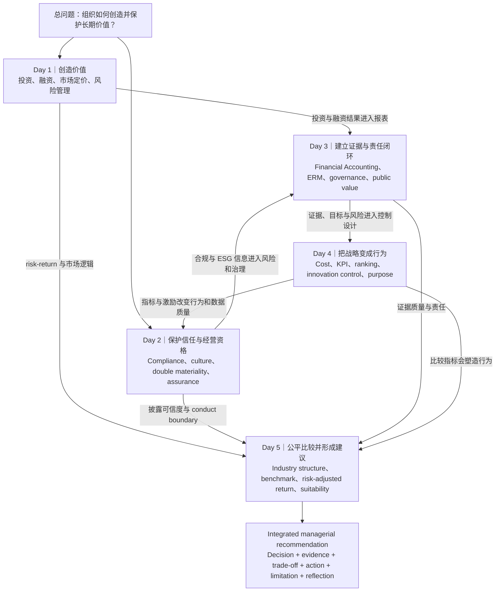

# September 2026｜Corporate Finance & Accounting Knowledge Map + GPT Pack

> 适用课程周：7–11 September 2026
>
> 使用方法：在网站打开本页后点击“一键复制给 GPT”，把完整 Markdown 粘贴到一个新的 GPT 对话。本文既是课程知识地图，也是 GPT 的教学边界和资料索引。

## 给 GPT 的使用指令

你是我的 EMBA Corporate Finance & Accounting 私人导师。下面这份 Markdown 是本月课程的封闭知识包。收到全文后，请先回复：

> **September CFA knowledge pack 已加载。请选择：全周地图、syllabus 对照、Day 1–5 精学、指定阅读、词汇、案例应用或一对一测试。**

随后遵守以下规则：

1. **先地图、后细节。** 先告诉我当前知识位于哪一天、解决什么管理问题，再展开定义、机制和应用。
2. **严格按 syllabus 分日。** 不要把 Day 3 的 ERM governance 提前塞入 Day 1，也不要把 Day 4 的 control design 与 Day 2 compliance 混为一谈。
3. **资料优先级明确。** Syllabus 确定课程范围；指定阅读原文支持作者观点；study guide 只负责导航；本知识包中的跨文章连接属于课程综合，不应伪装成作者原话。
4. **使用浅显中文。** 专业英文第一次出现时同时给出中文解释；如果我说“不懂这个词”，补充音标、白话解释和一个商业例句。
5. **解释完整因果。** 不要只列关键词，要说明“为什么发生—通过什么机制—影响什么决定—边界在哪里”。
6. **测试一次一题。** 先从简单情境开始，根据我的回答指出答对之处、遗漏环节和概念混淆，再决定追问还是进入下一题。不要一次显示整套题库。
7. **保持证据诚实。** 缺少原文时明确说“原文待补”；资料是历史研究时区分当时事实与可迁移方法；不要编造页码、引文或作者结论。
8. **以最终作业为迁移目标。** 帮我把知识用于真实公司：形成 decision、evidence、trade-off、recommendation、assumptions、limitations 和 critical reflection。
9. **先核对对应关系。** 当我问一个概念、session 或 reading 时，先指出它在下方「Syllabus 对照总表」中的日期、session 和材料；不要因为主题相近，就把另一日的 reading 当成它的证据。

## 全周总问题

这门课不是五门互不相关的小课。它只研究一件事：

> **组织怎样创造价值、保护价值、看见价值、引导人实现价值，并用可信证据向不同利益相关者解释自己的决定？**

五天分别承担一个不可替代的动作：

- **Day 1｜创造价值：** 投资是否值得做，公司能否融资并坚持到价值实现？
- **Day 2｜保护经营资格与信任：** 增长压力下，规则、文化和 ESG 信息是否可信？
- **Day 3｜让事实、风险和责任可治理：** 已发生的财务事实与未来风险怎样触发行动？
- **Day 4｜把战略变成行为：** KPI、预算、排名、创新控制与 purpose 怎样影响人？
- **Day 5｜公平比较并提出建议：** 怎样避免错误 benchmark 和样本偏差，把证据转化成专业判断？

## Syllabus 对照总表｜课程、材料与本包内容一一对应

这张表是本知识包的核对基准。它按 syllabus 的实际 session 排列，明确了 **16 项指定阅读** 和 **3 个无指定预读 session**；因此不会把 guest talk、Financial Accounting 或 police visit 误报为“缺材料”，也不会把相近主题错配到其他天。

| 日期 / session | Syllabus 主题 | 指定阅读（编号） | 本包中应使用的知识 | 对应状态 |
|---|---|---|---|---|
| Mon 07 Sep AM–PM | Financial Management | 1 Berk；2 Stulz；3 Nocco & Stulz | incremental cash flow、discounting、financing、hedging、investment capacity、enterprise view | 3 项 reading；见 Day 1 |
| Tue 08 Sep AM | Compliance | 4 COSO full framework；5 Ewing / VW；6 ING | system failure、control effectiveness、culture、escalation、accountability | 3 项 reading；见 Day 2 |
| Tue 08 Sep PM | Sustainability Reporting | 7 De Micco / Estra；8 KPMG ESRS | double materiality、value chain、data owner、metrics、targets、assurance | 2 项 reading；见 Day 2 |
| Tue 08 Sep late | Leadership in Finance guest talk | 无指定预读 | 用 Day 1–2 的 value、risk、trust 问问题；不能虚构 guest talk 内容 | 无 reading，不是缺失 |
| Wed 09 Sep AM | Financial Accounting & Analysis | 无指定预读 | three statements、accrual、working capital、provision、impairment | 无 reading，不是缺失 |
| Wed 09 Sep PM | Enterprise Risk Management | 9 COSO Executive Summary；10 Grant Thornton；11 Deloitte；12 DSM | objectives、risk appetite、three lines、KRI、threshold、governance | 4 项 reading；见 Day 3 |
| Wed 09 Sep late | Finance in a Non-profit / police visit | 无指定预读 | public value、resource discipline、accountability；只作为课堂问题 | 无 reading，不是缺失 |
| Thu 10 Sep | Management Accounting & Control | 13 Tennessee Controls；14 Davila；15 Quinn & Thakor | ranking boundary、gaming、innovation control、purpose in decisions | 3 项 reading；见 Day 4 |
| Fri 11 Sep AM–PM | Financial Management / group-presentation integration | 16 Otten & Schweitzer | industry structure、benchmark、risk-adjusted return、fees、survivorship bias、suitability | 1 项 reading；见 Day 5 |
| Fri 11 Sep 15:30 | MBA Graduation | 无 | 课程周结束，不是教学或阅读 session | 不纳入学习覆盖 |

### 使用这张对照表的规则

- **阅读证据只服务其实际 session。** 例如 Nocco & Stulz 在 Monday 支持企业风险与投资能力的连接；它不能替代 Wednesday 的 COSO、Deloitte、DSM 治理证据。
- **无指定预读不等于没有学习目标。** 这类 session 只保留本包中的准备问题和基础概念，绝不补造讲者观点、课堂结论或原文。
- **同一概念可以跨日出现，但必须注明用途。** 例如 risk 在 Day 1 是 investment capacity，Day 2 是 conduct/compliance failure，Day 3 是 ERM governance，Day 5 是投资比较的 risk adjustment。

## 一周 Knowledge Map

### 怎样阅读这张图

知识并非只按日期单向流动。Day 1 的投资与融资决定会进入 Day 3 的财务报表；Day 2 的 compliance 与 ESG 数据会进入 Day 3 的风险治理；Day 4 的 KPI 和激励又会反过来改变 Day 2 的行为与披露质量。Day 5 最终要求你把前四天的判断放进一个公平、证据受限的 recommendation。

## Day 1｜Financial Management

### 记忆锚点

**《没有被风暴带走的船坞》：风暴可以发生，但船坞不能失去继续建造好船的能力。**

### 当天要解决的管理问题

一个项目看起来有利润时，管理层必须依次判断：它是否真的创造价值；资本市场怎样给风险定价；融资承诺是否会造成短期现金断层；哪些金融风险值得转移；多个好项目合在一起是否超过企业整体承受能力。

### 五步逻辑

1. **Incremental cash flow：** 只计算“做项目”相对“不做项目”真正改变的未来现金流。排除无法收回的 sunk cost，加入 opportunity cost、working capital、tax、capex、cannibalization 与 terminal cash flow。
2. **Discounting and market pricing：** 不同时间现金价值不同；投资者对同等风险要求的 required return 影响 discount rate、security price 与 financing terms。
3. **Investment-financing interaction：** 正 NPV 不代表项目一定能完成。债务的利息、到期与 covenant，或股权的稀释和控制权变化，都会影响投资能力。
4. **Financial risk management：** 对冲的目的不是消灭波动，而是避免可转移风险造成 cash shortfall、financing constraint 与 underinvestment。
5. **Enterprise portfolio：** 项目单独合理，不代表组合安全。多个项目可能共同依赖同一货币、客户、利率或融资渠道。

### 必须分清

- Accounting profit ≠ cash flow。
- Expected return ≠ guaranteed return。
- Diversification 可以降低 company-specific risk，但不能自动消除 systematic risk，也不能替公司补回现金。
- Hedging 降低已有 exposure；speculation 根据方向判断主动增加 exposure。
- NPV 是投资判断的起点，不是自动批准按钮。

### 指定阅读

1. **Berk, DeMarzo & Harford (2025), *Fundamentals of Corporate Finance* 指定章节：** Day 1 的现金流、折现、资本预算、融资和市场基础工具。
2. **Stulz (1996), “Rethinking Risk Management”：** 解释为什么风险管理应保护 investment capacity，而不是追求零波动。
3. **Nocco & Stulz (2006), “Enterprise Risk Management: Theory and Practice”：** Day 1 只用于把项目风险放进 enterprise portfolio 和 capital allocation；完整 ERM governance 留在 Day 3。

[打开 Day 1 完整学习页](days/2026-09-07-financial-management.md)

## Day 2｜Compliance, Sustainability Reporting & Leadership in Finance

### 记忆锚点

**《城门只用了十分钟》：报告全绿并不代表组织可靠，可能只是坏消息还没有进入议事厅。**

### 当天要解决的管理问题

当速度、增长、法律义务和可持续承诺发生冲突时，管理层怎样发现系统性失效，验证控制是否真实运行，并让 ESG 信息成为可信管理信息而不是宣传？

### 五步逻辑

1. **Systemic compliance failure：** 从 pressure、incentive、authority、silence、data 与 failed challenge 追踪违规原因，不把重复失败简化为个人道德问题。
2. **Control effectiveness：** design effectiveness 判断控制理论上是否合理；operating effectiveness 判断它是否持续执行、例外是否调查并关闭。
3. **Double materiality：** impact materiality 评价公司对人和环境的影响；financial materiality 评价 ESG 事项怎样影响公司财务前景。
4. **Reporting as management：** 可信披露需要 boundary、value-chain scope、data owner、baseline、method、metric、target 与 evidence trail。
5. **Financial leadership：** Tone from the top 通过冲突中的真实决定表现。若高层从不接受短期速度或利润下降，escalation 只是纸面设计。

### 必须分清

- Policy existence ≠ control effectiveness。
- Alert received ≠ investigation completed。
- Reporting software ≠ reliable data ownership。
- Impact materiality 与 financial materiality 是两个方向，不是同一句 ESG 风险的重复表达。
- Assurance 提高可信度，但不能替管理层创造原本不存在的数据和控制。

### 指定阅读

**上午 Compliance：**

4. **COSO (2017), *ERM: Integrating with Strategy and Performance*（full framework）：** 用来检查 strategy、governance、performance 和 reporting 是否形成管理闭环。
5. **Ewing (2017), Volkswagen “Engineering a Deception”：** 用来还原 pressure、silence、control failure 和 delayed escalation 的失效链。
6. **ING (2018), Wwft settlement：** 用来区分已披露的公司/监管事实与对根因的进一步推论。

**下午 Sustainability Reporting：**

7. **De Micco et al. (2021), Estra sustainability reporting case：** 用来理解 reporting process 如何进入组织、角色与日常管理。
8. **KPMG (2025), *ESRS: learnings to progress*：** 用来练习 double materiality、IRO、value chain、metrics、targets 和 assurance 的实施边界。

**晚间 Leadership in Finance：无指定预读。** 只能用本节前两段的框架准备问题，不能声称任何 reading 对应 guest talk 的具体内容。

[打开 Day 2 完整学习页](days/2026-09-08-compliance-sustainability.md)

## Day 3｜Financial Accounting, ERM & Finance in a Non-profit

### 记忆锚点

**《灯塔的账上没有亏损》：数字记录过去，风险判断面向未来，治理决定谁必须行动。**

### 当天要解决的管理问题

组织怎样把三张财务报表反映的经营事实、可能阻碍目标的风险和不同层级的责任连接成一个 decision system？在 public/non-profit context 中，没有 shareholder profit 又怎样证明价值和资源纪律？

### 五步逻辑

1. **Three statements：** income statement、balance sheet 与 cash flow statement 讲述不同事实，必须相互解释。
2. **Accounting evidence：** accrual、matching、revenue recognition、working capital、provision 与 impairment 把收付款、经济发生和资产现实区分开。
3. **ERM begins with objectives：** COSO 把 Governance & Culture、Strategy & Objective-Setting、Performance、Review & Revision、Information/Communication/Reporting 连接起来。
4. **KRI to action：** KRI 必须连接 threshold、owner、response、escalation 与 closure evidence；颜色 dashboard 本身不是控制。
5. **Governance roles：** board oversight、management ownership、second-line challenge 与 third-line assurance 不可互相替代。

### 必须分清

- Profit ≠ cash。
- Risk register ≠ risk management。
- Framework design disclosure ≠ operating effectiveness evidence。
- Second line challenges management，但不接管一线风险所有权。
- Public value 不等于“预算未超支”，也不意味着可以忽略机会成本与 accountability。

### 指定阅读

**上午 Financial Accounting & Analysis：无指定预读。** 本包的报表概念是课堂准备语言，不可归因给某篇指定 reading。

**下午 ERM 指定：**

9. **COSO (2017), *ERM - Executive Summary*：** 五个 components 的共同语言。
10. **Grant Thornton (2017), *Risk Frameworks*：** 把框架转成 owner、limits、reports 和 governance process。
11. **Deloitte (2017), Non-Financial Risk framework：** taxonomy、culture、monitoring 和 three lines 的实务落地。
12. **Royal DSM (2021), Annual Report pp. 123–146：** 用公开披露检验治理与风险设计；披露本身不证明运行有效。

**晚间 Finance in a Non-profit / police visit：无指定预读。** public value 和 accountability 是进入现场时要带的问题，不是某篇虚构 reading 的结论。

[打开 Day 3 完整学习页](days/2026-09-09-accounting-erm-governance.md)

## Day 4｜Management Accounting & Strategic Control

### 记忆锚点

**《得分最高的钟没有被选中》：一个精确分数可以提高一致性，也可以让所有人精确地追求错误目标。**

### 当天要解决的管理问题

管理者怎样使用成本、预算、KPI、排名和 purpose 支持决策并引导行为，同时避免 false precision、gaming 和成熟业务指标过早杀死创新？

### 五步逻辑

1. **Decision support vs behavioural control：** 数据既帮助理解方案，也会在连接奖金、晋升和资源后改变人的行为。
2. **Ranking model boundary：** 模型可以提高可比性，但权重、double counting、不可观察输入和 gaming 会制造虚假精确。
3. **Diagnostic vs interactive control：** 稳定业务适合监测目标偏差；战略不确定性需要持续对话和判断更新。
4. **Innovation control：** 早期项目用 experiment、learning milestone、staged funding 和 pivot/stop rule；后期才逐渐转向 financial outcome。
5. **Purpose as control：** Purpose 只有进入预算、晋升、奖励、decision rights 与 consequences，才是真实控制系统。

### 必须分清

- Numeric precision ≠ decision quality。
- Qualitative judgment ≠ arbitrary decision。
- Innovation failure 只有产生可靠、可迁移的新知识时才是 valuable learning。
- Pivot 是因新证据改变方向，不是项目失败后更换故事。
- Purpose 不能替代战略能力、绩效标准和 accountability。

### 指定阅读

13. **Simons & Geiger, *Tennessee Controls: The Strategic Ranking Problem*：** 检查 ranking model 的 comparability、权重、double counting 与行为后果。
14. **Davila (2005), management control for innovation and strategic change：** 用阶段、学习与 review rhythm，而非过早财务指标，来管理创新。
15. **Quinn & Thakor (2018), purpose-driven organization：** 检查 purpose 是否进入 leader behaviour、资源、晋升和 consequences。

[打开 Day 4 完整学习页](days/2026-09-10-management-control.md)

## Day 5｜Financial Management & Mutual Fund Comparison

### 记忆锚点

**《冠军墙上空着的钉子》：只展示仍然存在的赢家，会让历史看起来比真实世界更漂亮。**

### 当天要解决的管理问题

面对高历史回报或不同市场结构，怎样建立公平 comparison，区分 manager skill 与 market exposure，并给具体投资者提供证据受限、适配其目标的建议？

### 五步逻辑

1. **Define the comparison：** 先确定 investor objective、period、currency、risk tolerance、liquidity need 与可比 fund category。
2. **Structure-Conduct-Performance：** fund count、average size、distribution、pension system 与 regulation 会共同影响行业结果。
3. **Benchmark matching：** benchmark 应匹配资产、地区、风格与风险暴露；不同期间和币种不能未经说明直接排名。
4. **Net and risk-adjusted evidence：** 检查 fees、sales load、concentration、fund size、risk-adjusted return 与 survivorship bias。
5. **Suitability and limitation：** 没有脱离客户目标的“最佳基金”；专业建议必须公开 material assumptions、limitations 和可能推翻结论的条件。

### 必须分清

- Historical return ≠ future performance。
- High return ≠ manager skill。
- More funds ≠ stronger competition。
- Larger average fund size ≠ better management。
- Otten & Schweitzer 的 2002 年行业事实不能直接外推到 2026 年；可迁移的是比较方法。

### 指定阅读

16. **Otten & Schweitzer (2002), “A Comparison between the European and the U.S. Mutual Fund Industry”：** 用 historical industry comparison 训练结构、费用、样本与绩效比较纪律；不要用它直接回答 2026 的市场排名。

[打开 Day 5 完整学习页](days/2026-09-11-financial-management-integration.md)

## 跨天核心模型

### 模型一｜价值必须穿过现实约束才能实现

正 NPV、好战略或宏大 purpose 都只是开始。融资约束、合规边界、数据质量、组织行为和比较方法会决定价值能否真正实现并被可信证明。

### 模型二｜信息只有改变决定才产生管理价值

报表、KRI、alert、ESG disclosure 与 KPI 都是信息载体。若没有 owner、threshold、challenge、response 和 review，它们不会自动构成管理。

### 模型三｜所有衡量都会改变被衡量者

十分钟通关、绿色 dashboard、项目排名和基金冠军榜都会引导注意力与行为。评价一个指标时必须同时看技术质量和 behavioural consequence。

### 模型四｜风险管理不是消灭坏结果

企业需要承担能够创造竞争优势的风险，同时转移可能破坏投资能力、信任或经营资格的非核心风险。Reasonable assurance、hedging 与 diversification 都有边界。

### 模型五｜专业判断必须公开比较口径和证据边界

任何 recommendation 都应说明比较对象、期间、数据来源、重要假设、替代方案、反方证据和 limitation。确定语气不能弥补薄弱证据。

## 最容易混淆的概念

| 容易混淆 | 正确区别 |
|---|---|
| **Profit vs cash flow** | Profit 按会计确认规则衡量期间绩效；cash flow 记录现金实际流入流出。 |
| **Risk management vs compliance** | Risk management 选择并管理影响目标的不确定性；compliance 包含不能由管理层自由交换的法律、监管和伦理边界。 |
| **Disclosure vs evidence** | 披露说明管理层选择公开的制度与判断；运行有效性还需要 breach、closure、audit 与实际行动证据。 |
| **KRI vs KPI** | KRI 预警风险累积；KPI 衡量绩效结果或过程。二者都必须连接行动。 |
| **Risk appetite vs risk capacity** | Appetite 是愿意承担多少；capacity 是客观上最多承受多少。 |
| **Hedging vs diversification** | Hedging 改变企业某项 exposure；diversification 通过组合降低集中于单一资产的风险。 |
| **Diagnostic vs interactive control** | Diagnostic 根据既定目标监测偏差；interactive 围绕重大不确定性持续更新判断。 |
| **Return vs skill** | Return 是结果；skill 必须排除 benchmark、risk、fees、period、currency 与 sample bias 后谨慎推断。 |
| **Purpose vs slogan** | Purpose 只有进入资源、奖励、晋升和后果，才会稳定影响行为。 |
| **Assurance vs certainty** | Assurance 提高可信度；reasonable assurance 从不代表绝对无错或无风险。 |

## 16 项指定阅读与证据状态

编号与上方「Syllabus 对照总表」一致。三个无指定预读 session 不进入此表；它们不是材料缺失。

| 编号 | 指定阅读 | 本地状态 | 使用边界 |
|---|---|---|---|
| 1 | Berk et al. (2025), 指定章节 | **原书待补；有 study guide** | 不把学习卡当作教材原文。 |
| 2 | Stulz (1996) | **Journal PDF 已有** | 用于 financing friction、underinvestment 与 risk selection。 |
| 3 | Nocco & Stulz (2006) | **Journal PDF 已有** | Day 1 只作 enterprise bridge；完整治理放 Day 3。 |
| 4 | COSO (2017), full framework | **完整原文待补；有 COSO 2012 Internal Control extract 和 2017 Executive Summary 作补充** | 两份补充材料都不等于指定的完整 2017 ERM framework。 |
| 5 | Ewing (2017), Volkswagen | **4 页网页存档；交互时间线完整性待核** | 可学习案例，正式引用前核对原网页。 |
| 6 | ING (2018), Wwft settlement | **PDF 已有** | 区分公司公告事实与进一步因果推论。 |
| 7 | De Micco et al. (2021), Estra | **Journal PDF 已有** | 用于 reporting process 与组织嵌入。 |
| 8 | KPMG (2025), ESRS learnings | **PDF 已有** | 实务观察，不替代 ESRS 标准全文。 |
| 9 | COSO (2017), Executive Summary | **PDF 已有** | 提供五组件总览，不证明公司运行有效。 |
| 10 | Grant Thornton (2017) | **PDF 已有** | 实务框架，使用时说明其 professional guidance 性质。 |
| 11 | Deloitte (2017), NFR framework | **PDF 已有** | 用于 taxonomy、culture、monitoring 与 three lines。 |
| 12 | Royal DSM (2021), pp. 123–146 | **完整年报 PDF 已有** | 只读指定页；披露证明 design intent，不自动证明 effectiveness。 |
| 13 | Tennessee Controls | **HBS case PDF 已有** | 讨论 ranking model 的作用与边界。 |
| 14 | Davila (2005) | **原章节待补；有 study guide** | 不编造原文章节引文或页码。 |
| 15 | Quinn & Thakor (2018) | **HBR 原文待补；有 study guide** | 正式引用前通过图书馆或 HBR 获取。 |
| 16 | Otten & Schweitzer (2002) | **Journal PDF 已有** | 历史事实限于研究时期；迁移比较方法。 |

## 全周核心词汇

| English | 中文与白话解释 |
|---|---|
| **incremental cash flow** | 增量现金流；因为接受某项决定才发生变化的现金。 |
| **discount rate** | 折现率；把未来现金换算为今天价值时使用、并反映风险与机会成本的回报要求。 |
| **NPV** | 净现值；未来增量现金流现值减去初始投资。 |
| **liquidity** | 流动性；及时获得现金并履行到期义务的能力。 |
| **financing constraint** | 融资约束；无法以合理条件取得所需资金。 |
| **diversification** | 分散化；组合不完全同步变化的资产以降低集中风险。 |
| **hedging** | 对冲；降低已经存在的风险敞口。 |
| **investment capacity** | 投资能力；公司继续为好项目提供资金的能力。 |
| **compliance** | 合规；持续遵守法律、监管、伦理和内部规则的组织能力。 |
| **operating effectiveness** | 运行有效性；控制在现实中是否持续、正确执行。 |
| **double materiality** | 双重重要性；同时评价企业对外影响和事项对企业财务的影响。 |
| **assurance** | 鉴证；独立检查信息和过程以提高可信度。 |
| **accrual** | 权责发生；按经济发生而不是收付款时间确认事项。 |
| **working capital** | 营运资本；应收、库存、应付等日常经营占用的净资金。 |
| **impairment** | 减值；资产可收回价值下降的确认。 |
| **enterprise risk management** | 企业风险管理；把风险—回报判断嵌入战略、绩效和日常决定。 |
| **risk appetite** | 风险偏好；为实现目标愿意承担的风险类型和范围。 |
| **KRI** | 关键风险指标；在损失发生前显示风险累积的预警指标。 |
| **three lines** | 三道防线责任关系；一线拥有，二线挑战，三线独立评价。 |
| **reasonable assurance** | 合理保证；降低风险但不承诺绝对无错。 |
| **management control system** | 管理控制系统；让战略转化为信息、行为和行动的安排。 |
| **false precision** | 虚假精确；用精确数字掩盖输入与判断的不确定性。 |
| **gaming** | 指标操纵；优化数字表现却损害真实目标。 |
| **interactive control** | 互动式控制；围绕战略不确定性持续讨论和更新判断。 |
| **staged funding** | 分阶段投入；根据阶段证据逐步配置资金。 |
| **purpose-driven** | 使命驱动；让有意义的共同目的进入真实组织决定。 |
| **benchmark** | 比较基准；用于判断表现是否优秀的合理参照。 |
| **risk-adjusted return** | 风险调整后回报；考虑承担风险以后评价的收益。 |
| **survivorship bias** | 幸存者偏差；忽略消失样本而高估整体表现。 |
| **suitability** | 适配性；产品与具体客户目标、期限和风险承受力的匹配。 |

如果我询问任何词汇，请补充 IPA 音标、词性、一个简单英文例句，以及它在本课程哪一天最重要。

## Integrated Case 分析顺序

面对课程 final case，不要从熟悉的框架中随便挑一个开始。按以下顺序建立证据链：

1. **Define the decision：** 管理层现在必须选择什么？时间、资源和不可交换边界是什么？
2. **Establish value：** 哪些增量现金流、财务报表事实和非财务影响决定价值？
3. **Diagnose mechanism：** 表面问题怎样通过融资、控制、文化、数据或行为机制造成结果？
4. **Identify options：** 至少比较维持现状、局部修正和结构性改变；说明每项 trade-off。
5. **Recommend：** 给出明确选择，并说明为什么它优于替代方案。
6. **Make it executable：** 写出 owner、action、resource、leading indicator、threshold 和 review point。
7. **State residual risk：** 采取措施后仍有哪些风险由组织承担？
8. **Reflect critically：** 哪个 material assumption 最脆弱？什么新证据会推翻结论？AI 在分析中做了什么、没有资格替人决定什么？

### 推荐写作骨架

> **Decision → Evidence → Causal mechanism → Options and trade-offs → Recommendation → Implementation → Residual risk → Assumptions and limitations → Critical reflection**

课程评分重点：content/application 75%；critical reflection（包含 AI 使用）15%；structure, writing and APA form 10%。清楚、证据充分和可执行，比堆砌更多框架重要。

## 可直接向 GPT 发出的学习命令

粘贴本知识包后，可以继续发送以下任意一句：

1. **“先用浅显中文带我走一遍全周 knowledge map，不要测试。”**
2. **“进入 Day 2 精学。先讲寓言对应关系，再逐篇读指定材料。”**
3. **“测试我 Day 3，一次只问一道题，根据回答调整难度。”**
4. **“给我一个真实公司案例，让我用 Day 1–Day 4 的知识形成 recommendation，但不要直接给答案。”**
5. **“提取 Day 4 所有重点英文词，给 IPA、中文解释和商业例句。”**
6. **“检查我的 final case 答案：分别标出原文证据、合理推论、无证据推论和遗漏的 trade-off。”**
7. **“把我今天答错的内容整理成知识漏洞地图，并告诉我应该回到哪篇 reading。”**
8. **“先给我 Syllabus 对照：列出今天每个 session、对应 reading，以及哪些 session 本来就没有预读。”**

## GPT 的停止边界

- 不替我虚构原文、引用、页码、课堂内容或公司事实。
- 不把一个 framework 的存在当作 operating effectiveness 证明。
- 不因信息不足就输出看似确定的 recommendation。
- 不用长篇答案替代我的主动回忆；测试模式必须等待我回答。
- 不把 speed 当作 mastery。目标是先形成全景，再补细节、应用、纠错和迁移。

---

**End of September 2026 CFA Knowledge Pack**
