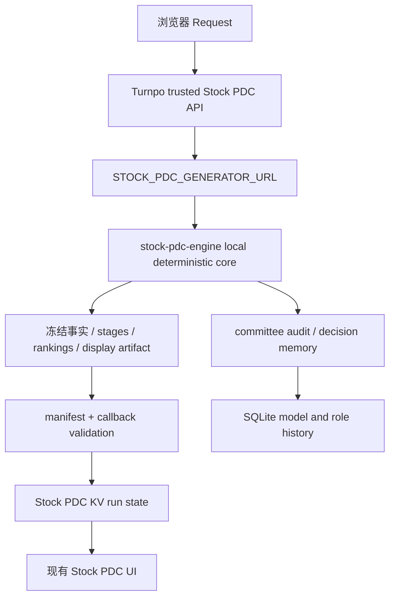
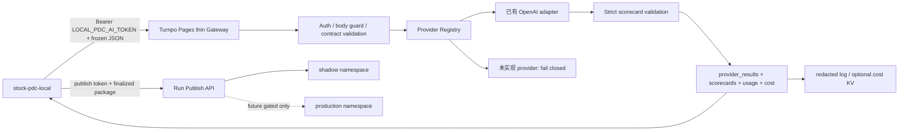

# Turnpo × stock-pdc-local：Cloudflare / Provider Readiness Audit

审计日期：2026-08-13  
仓库：Turnpo Production Repository  
审计范围：Turnpo Pages Functions、Stock PDC trusted API、`stock-pdc-engine`、新 Provider Gateway 代码、契约、测试和可见部署配置。  
安全边界：没有读取、复制或输出任何 API key、token、secret value；没有连接券商；没有发布交易结果；没有改变现有 Stock PDC 页面或生产 Run 行为。

> 状态更新（2026-08-14）：Cloudflare Preview route 已部署并通过 fail-closed JSON probes；Preview 尚未配置独立 gateway/provider credential，因此没有发起真实 OpenAI request。当前状态以 `OPENAI_REAL_SHADOW_PARTIALLY_READY` 为准。

## 结论先行

当前代码已经具备一个可审计的 Provider Gateway 骨架和机器契约，但还没有完成“五个真实 Provider + Cloudflare 部署 + stock-pdc-local 实际联网验收”。本 broad readiness 结论由本次 OpenAI 部署审计进一步收敛为：

```text
OPENAI_REAL_SHADOW_PARTIALLY_READY
```

这不是说代码没有落地，而是说“完整目标”尚未完成。已经落地的部分包括：

- `provider-execution-v1` 与 `pdc-ai-contract-v1` 严格契约；
- `POST /api/v1/pdc/gateway` canonical thin gateway；
- 旧的 `POST /api/v1/pdc/evaluate/shadow` 兼容入口；
- 真正的 Provider Registry：只有仓库内已有 OpenAI adapter 可执行；
- `GET /api/v1/provider/health` 配置态健康检查；
- `POST /api/v1/pdc/runs/publish` 与 shadow/production namespace 隔离；
- request validation、timeout、有限 retry、usage/cost logging、限流/预算控制骨架；
- 未实现 Provider 明确失败，不伪造 completion。

尚未完成的部分包括：Cloudflare 项目实际 secret/binding 验收、Anthropic/Gemini/DeepSeek/Kimi adapter、五 Provider smoke test、真实 shadow evidence、Local PDC 实际接入和任何 production gate。

## 1. 当前 Turnpo 架构审计

### 1.1 当前真实 outbound Provider 调用

仓库中可以直接证明的真实外部模型调用仍然只有 OpenAI，并且属于两个非 Stock PDC 的既有功能：

| Provider | 文件 | 调用 | 输入 | 输出/验证 | 模型 | 错误与成本 |
| --- | --- | --- | --- | --- | --- | --- |
| OpenAI | `functions/api/ai/import-profile.js`；共享 transport 为 `functions/api/ai/_openai.js` | `fetchOpenAiResponses()` | profile source text、profile metadata | JSON draft，随后本地解析/归一化 | `OPENAI_MODEL` 或既有 fallback `gpt-4o-mini` | 缺 key/HTTP 错误/JSON 错误返回错误；没有既有 token/cost ledger |
| OpenAI | `functions/api/jobs/search.js`；共享 transport 为 `functions/api/ai/_openai.js` | `fetchOpenAiResponses()` | 保存的 Turnpo Markdown | JSON search profile，随后确定性合并 | `OPENAI_JOBS_MODEL`、`OPENAI_MODEL` 或既有 fallback `gpt-4o-mini` | 有 timeout/fallback；没有既有 token/cost ledger |

Claude、Gemini、DeepSeek、Kimi 没有在仓库中发现可执行的 API URL、client、response parser 或 provider adapter。它们在 Stock PDC 代码中是模型审计/结果协议的身份，不是已经存在的 Provider Registry。

### 1.2 当前 Stock PDC 生产链



当前生产 Stock PDC 是本地确定性计算链；没有被本次 Gateway 接管，也没有把 Provider response 写进现有 production Run/UI。

### 1.3 新增边界



## 2. Credentials presence audit

下表只表示 `PRESENT`、`MISSING` 或 `UNKNOWN`，不表示、更不输出任何 secret value。

“仓库引用”只检查 source/config 是否有对应 binding 名称；“部署 presence”需要 Cloudflare 项目权限或 secret listing，本次没有读取任何 secret value，也没有可见的根目录 `wrangler` 部署配置，因此不能把部署状态猜成 PRESENT/MISSING。

| Provider | 仓库引用 presence | 部署 binding presence | 可执行 adapter | 当前判断 |
| --- | --- | --- | --- | --- |
| OpenAI | PRESENT：既有代码读取 `OPENAI_API_KEY` | UNKNOWN | PRESENT：共享 OpenAI Responses transport | PARTIAL |
| Claude / Anthropic | MISSING：未发现 Anthropic key/client 读取 | UNKNOWN | MISSING | BLOCKED |
| Gemini / Google AI Studio | MISSING：未发现 Gemini/Google key/client 读取 | UNKNOWN | MISSING | BLOCKED |
| DeepSeek | MISSING：未发现 DeepSeek key/client 读取 | UNKNOWN | MISSING | BLOCKED |
| Kimi / Moonshot | MISSING：未发现 Kimi/Moonshot key/client 读取 | UNKNOWN | MISSING | BLOCKED |

本次没有读取 `turnpo-local/.env.local` 或任何可能含有值的 env 文件；没有运行会打印 secret value 的命令。`PDC_PUBLISH_KV`、`PDC_BUDGET_KV`、`PDC_RATE_KV` 等 binding 在仓库可见代码中有约定，但实际 Cloudflare binding presence 仍为 UNKNOWN。

## 3. Cloudflare 官方能力核对

截至本审计日，Cloudflare 官方文档确认：

| 能力 | 官方结论 | 对本项目的影响 |
| --- | --- | --- |
| BYOK / Secret Vault | AI Gateway BYOK 将 provider key 存入 Secrets Store，调用方不再提交 provider Authorization header，只需 gateway authorization | 适合把 provider secret 留在 Cloudflare；但本仓库没有可见的 account/gateway/BYOK deployment evidence，因此不能标记已部署 |
| Native Provider | 官方 Native Provider 页面列出 Anthropic、DeepSeek、Google AI Studio、OpenAI 等 | 这些能力可作为未来 adapter/route；仍需逐个验证模型、response format 和 Structured JSON 兼容性 |
| Custom Provider | 官方支持任意 HTTPS provider endpoint，并提供 provider-specific path、observability、caching、rate limiting 等能力 | Kimi 等不在当前 native list 的 provider 可评估 Custom Provider；不能在仓库内猜测其 endpoint 或模型名 |
| Rate limiting | AI Gateway 支持固定或 sliding rate limit | 应作为边缘硬限流；代码中的 KV counter 只作应用层 fallback，不宣称强一致 |
| Logging | Gateway 日志可能包含 prompt、response、provider、model、usage、cost 等 | 生产上必须先决定数据保留/DLP；Turnpo 自己的日志只写 redacted metadata |
| KV consistency | Workers KV 是 eventually consistent，非 atomic transaction 存储 | publish idempotency、daily budget、per-run counter 不能仅依赖 KV 作为强一致金融/配额边界 |

官方参考：

- [BYOK / Store Keys](https://developers.cloudflare.com/ai-gateway/configuration/bring-your-own-keys/)
- [Provider Native](https://developers.cloudflare.com/ai-gateway/usage/providers/)
- [Custom Providers](https://developers.cloudflare.com/ai-gateway/configuration/custom-providers/)
- [AI Gateway rate limiting](https://developers.cloudflare.com/ai-gateway/features/rate-limiting/)
- [AI Gateway logging](https://developers.cloudflare.com/ai-gateway/observability/logging/)
- [Workers KV consistency](https://developers.cloudflare.com/kv/concepts/how-kv-works/)

## 4. 当前 Provider Registry 判断

原有 Turnpo 代码没有 Provider Registry，原因是：

- OpenAI URL、model fallback、timeout 和 response parsing 原先散落在两个 Function；
- `MODEL_IDS`/model audit 名单没有 adapter、secret reference、model allowlist 或 health state；
- 没有统一的 budget、retry、validation、usage/cost 入口；
- 不能从“协议中出现 provider 名称”推导“该 provider 可执行”。

现在新增的 `functions/api/v1/pdc/_provider-registry.js` 已建立真实 registry：

| Registry provider id | adapter | upstream route | 状态 |
| --- | --- | --- | --- |
| `openai` | `openai_responses` | 复用现有 OpenAI Responses transport | 可执行，仍需部署 key/model allowlist |
| `claude` | 无 | 不填 | 协议身份，明确不可调用 |
| `gemini` | 无 | 不填 | 协议身份，明确不可调用 |
| `deepseek` | 无 | 不填 | 协议身份，明确不可调用 |
| `kimi` | 无 | 不填 | 协议身份，明确不可调用 |

没有假 adapter、没有 guessed URL、没有复制 key。

## 5. Readiness matrix

| 项目 | 代码状态 | 部署/验收状态 | 结论 |
| --- | --- | --- | --- |
| PDC AI Contract v1 | 已实施 | 未要求部署即可做静态测试 | 已完成 |
| Provider Execution v1 | 已实施 | 未做真实远端验收 | 已完成骨架 |
| Canonical Gateway | 已实施 | Cloudflare route/token 未验收 | 部分完成 |
| Provider Registry | 五个协议身份，OpenAI 一个 adapter | 四个真实 adapter 未实施 | 未完成 |
| Health check | 配置态 GET 已实施 | 未做真实 smoke test | 部分完成 |
| Timeout/retry | 服务端上限与有限 retry 已实施 | 未做真实 latency evidence | 部分完成 |
| Cost tracking | 结构化 log + optional KV 已实施 | price table/binding 未验收 | 部分完成 |
| Rate limit | KV best-effort + 可接 Cloudflare edge limit | edge policy 未验收 | 部分完成 |
| Budget | per-request + optional daily/provider/run guard | budget KV/atomic policy 未验收 | 部分完成 |
| Run publish | strict shadow publish + idempotency scaffold | storage binding/retention 未验收 | 部分完成 |
| Local PDC actual integration | 未接入 | 未执行 | 未完成 |
| Production PDC/UI | 未修改 | 现有路径保持不变 | 无影响 |

## 6. 生产影响结论

本次新增代码不被现有 Stock PDC 页面调用，不改变网页展示，不改变现有 `/stock-pdc/decision/api`，不写现有 production Run state，不连接券商，也不发布交易结果。

只有同时满足以下条件时，才会产生真实 Provider 成本：

1. deployment 配置了 AI service token；
2. server-side Provider key/BYOK 已配置；
3. mode 明确设置为 `REAL_SHADOW`；
4. provider/model 通过 Registry 与 server-side allowlist；
5. caller 提交合法 frozen snapshot。

生产模式和 production publish 当前仍被代码明确拒绝或关闭。

## 7. 审计结论

Turnpo 已经具备“可供 Local PDC 接入的版本化、严格校验、fail-closed Gateway 设计和代码骨架”，但还没有完成真实五 Provider 能力、Cloudflare 部署证明或 Local PDC 联网验收。

当前总状态：

```text
OPENAI_REAL_SHADOW_PARTIALLY_READY
```
