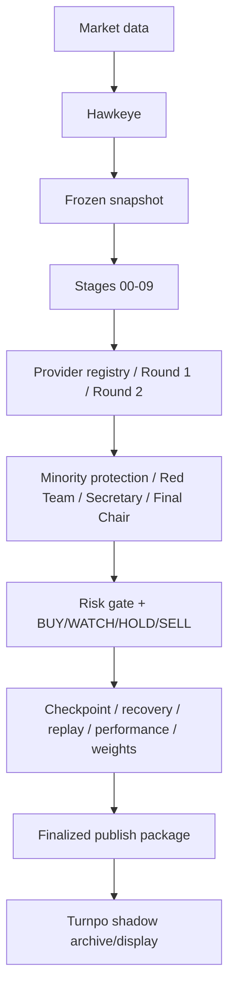

# stock-pdc-local Integration Readiness

> 当前 Provider Gateway 的 canonical contract、binding matrix 和 live gap 以根目录 `LOCAL_PROVIDER_HANDOFF.md` 与 `reports/api/PROVIDER_SERVICE_AUDIT.md` 为准；本文件保留此前 local PDC-specific 评估契约的历史 readiness 记录。

审计日期：2026-08-13  
目标：判断 Local PDC 是否可以安全接入 Turnpo Provider Gateway，以及是否可以把 finalized Run 交给 Turnpo archive/display boundary。

> 状态更新（2026-08-14）：OpenAI REAL_SHADOW 的 Preview route 已部署并通过 fail-closed probes；真实 smoke 仍因 Preview credential/config gate 未完成而阻塞。本文件不能被解读为真实联网已通过。当前具体状态为 `OPENAI_REAL_SHADOW_PARTIALLY_READY`。

## 1. 一句话结论

可以开始“契约级、OFFLINE_TEST 级”的 Local 对接；不能把当前仓库标记为“真实 Provider 已验收、五模型可用或 production-ready”。

最终状态：

```text
OPENAI_REAL_SHADOW_PARTIALLY_READY
```

## 2. 两阶段验收状态

### 第一阶段：Local → Gateway → Provider → Scorecard

| 验收项 | 预期 | 当前证据 | 状态 |
| --- | --- | --- | --- |
| 统一 request contract | `provider-execution-v1` + `pdc-ai-contract-v1` | JSON schema + runtime validation + tests | PASS |
| AI auth | 独立 Local AI token | Gateway route + token separation code | CODE PASS / DEPLOY UNKNOWN |
| Provider registry | 五个固定 ID，只有真实 adapter 可调 | 5 registry identities，OpenAI 1 adapter | PARTIAL |
| OFFLINE_TEST | 不发 provider call | test passed | PASS |
| REAL_SHADOW | 真实 provider call + strict scorecard | 只用 mock fetch 验证，未跑真实 secret | NOT_YET_ACCEPTED |
| model allowlist | server-side model only | `PDC_OPENAI_ALLOWED_MODELS` guard | CODE PASS / CONFIG UNKNOWN |
| timeout/retry | finite, bounded | runtime code + mock test | PASS |
| usage/cost | structured response/log/optional KV | runtime code; price/binding unknown | PARTIAL |
| scorecard validation | exact ticker coverage/no uncontrolled fields | runtime code + tests | PASS |
| production isolation | 不进入现有 PDC UI/Run | route separation and no production writes | PASS |

### 第二阶段：Finalized Run → Shadow Storage → Shadow Display/API

| 验收项 | 预期 | 当前证据 | 状态 |
| --- | --- | --- | --- |
| 独立 publish token | AI token 不能 publish | publish route code + test | PASS |
| publish contract | `pdc-run-publish-v1` strict package | schema + runtime validator + test | PASS |
| finalized gate | `FINALIZED + PASS` only | runtime validator | PASS |
| research-only gate | `research_only=true`, `live_trading=false` | runtime validator | PASS |
| namespace | shadow 与 production 隔离 | key namespace + production gate | CODE PASS |
| idempotency | same package retry safe | local KV test | CODE PASS / KV CONSISTENCY UNKNOWN |
| shadow read | API read package | GET route + local test | CODE PASS |
| Turnpo existing UI | 不改变现有页面 | no UI code changed | PASS |
| actual deployment storage | dedicated `PDC_PUBLISH_KV` | binding not visible/verified | UNKNOWN |

## 3. Local PDC 的责任边界

Local PDC 必须继续拥有：



Turnpo 只处理 `E` 中的 provider execution boundary，以及 `I → J` 的 strict receive/store/version/display boundary。Turnpo 不重算 Local 的 score，不重新排序，不改变 weights，不接管 stages。

## 4. Local 调用顺序

1. Local 生成 frozen snapshot，并计算 `package_sha256`；
2. Local 选择已验证的 protocol provider/model；
3. Local 以 `LOCAL_PDC_AI_TOKEN` 调用 `/api/v1/pdc/gateway`；
4. Local 验证 response 的 `api_version`、schema version、run_id、provider status、scorecard coverage；
5. Local 把 provider response 纳入自身 stage/checkpoint/recovery；
6. Local 完成最终 ranking 和 risk gate；
7. Local 生成符合 `pdc-run-publish-v1` 的 finalized research package；
8. Local 用独立 `LOCAL_PDC_PUBLISH_TOKEN` 调用 `/api/v1/pdc/runs/publish`；
9. Local 用 GET API 或未来 shadow UI 查看已发布 package；
10. Local 不把 provider key 或 model secret 写入任何 artifact。

## 5. 接入前不可跳过的部署项

- [ ] 为 Gateway 创建独立 AI token；
- [ ] 为 publish 创建独立 publish token；
- [ ] 在 Cloudflare server-side/BYOK/Secrets Store 中配置真实 provider secret；
- [ ] 对实际 OpenAI model 设置 `PDC_OPENAI_ALLOWED_MODELS`；
- [ ] 配置 dedicated `PDC_PUBLISH_KV`、rate/budget binding；
- [ ] 设定 rate limit、daily/run budget、pricing table；
- [ ] health endpoint 返回真实 operator-attested status；
- [ ] 用非生产 frozen fixture 运行 real shadow；
- [ ] 记录 latency、retry、usage、cost、validation、candidate coverage；
- [ ] 确认四个未实现 provider 不会被 Local 误认为可调用；
- [ ] 确认现有 Stock PDC page/production Run 无 diff；
- [ ] 在 migration approval 前保持 production execution/publish gate 关闭。

## 6. 当前可接入与不可接入范围

### 可以

- Local 生成 request 并在 `OFFLINE_TEST` 验证协议；
- Local 使用 mock/staging transport 验证 retry、timeout、schema handling；
- Local 准备 finalized publish fixture 并写入 shadow namespace；
- Local 根据 health response 决定是否使用已配置的 adapter。

### 不可以宣称已经完成

- 五个 provider 都可真实调用；
- Cloudflare BYOK/Secrets Store 已存在并可用；
- OpenAI real shadow 已在本部署上成功；
- cost/budget/rate 是强一致金融级限制；
- publish 已进入现有生产 UI；
- production mode 已打开；
- Local PDC 已经联网联调。

## 7. Readiness decision

当前更准确的判断是：

```text
CONTRACT_READY_FOR_OFFLINE_LOCAL_INTEGRATION
REAL_GATEWAY_NOT_YET_ACCEPTED
PRODUCTION_NOT_ENABLED
```

因此当前总状态为：

```text
OPENAI_REAL_SHADOW_PARTIALLY_READY
```
