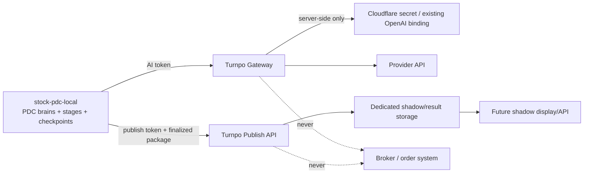

# Local PDC Gateway Security Audit

审计日期：2026-08-13  
安全目标：stock-pdc-local 可以调用 Turnpo 的已存在 Provider 能力，但 Local 不持有 provider key，Turnpo 不接管 Local PDC 的 orchestration、state machine、ranking 或交易执行。

## 1. Trust boundary

### 明确不在 Turnpo Gateway 的职责

- market data retrieval；
- Hawkeye candidate discovery；
- frozen snapshot creation；
- Stage 00–09 orchestration；
- committee voting、minority protection、Red Team、Secretary、Final Chair；
- ranking recomputation、weights、risk gate；
- checkpoint/recovery/daily MD/monthly review/replay；
- broker connection、order placement、automatic trading。

这些继续由 `stock-pdc-local` 负责。Turnpo 只做 provider execution、validate、usage/cost、接收 finalized package 和 archive/display boundary。

## 2. Credential isolation audit

| Secret class | 归属 | 允许出现的位置 | 不允许出现的位置 | 当前代码 |
| --- | --- | --- | --- | --- |
| OpenAI/未来 provider key | Turnpo/Cloudflare server-side | secret binding 或 Cloudflare BYOK/Secrets Store | Local repo、Local request、browser、URL、日志、Run package | OpenAI 既有 binding 被复用；其他 adapter 未实施 |
| `LOCAL_PDC_AI_TOKEN` | Turnpo Gateway auth | Local secret store + Turnpo server binding | Provider request body、provider key field、publish API | Gateway 使用 |
| `LOCAL_PDC_PUBLISH_TOKEN` | Turnpo publish auth | Local publish client + Turnpo server binding | AI Gateway、Provider API、Run package | Publish 使用 |
| Cloudflare API/admin token | deployment operator | Cloudflare admin tooling only | application runtime、Local PDC、logs | 未写入仓库 |

本次只审计 binding 名称和 source reference，不读取 value。Local PDC 的配置文档只给变量名和 endpoint，不给任何 secret。

## 3. Request attack surface

### 3.1 Authentication

- 只接受 `Authorization: Bearer`；不接受 query token；
- AI 与 Publish 使用不同 token；
- constant-time compare；
- token 缺失与错误分别给出 generic configuration/auth error，不回显 expected value；
- health endpoint 也需要 AI token，不是公开 provider inventory。

### 3.2 Payload boundary

- Gateway body 最大 256 KiB；Publish body 最大 512 KiB；
- 顶层和嵌套对象均 exact-key；
- candidates、scorecards、rankings、artifacts 有数量上限；
- frozen facts 限制深度、文本长度、数据大小和 JSON 类型；
- secret-like field name 会被拒绝；
- ticker coverage、duplicate ticker、duplicate rank、score/confidence/risk flag/decision 都做 runtime validation；
- `evaluation_schema_version`、`schema_version` 必须精确匹配版本；
- publish 禁止 narrative/raw provider output/uncontrolled fields。

### 3.3 Prompt/output injection

- Provider prompt 要求只使用 frozen facts、只输出严格 JSON、禁止 narrative、禁止 trading instruction；
- OpenAI Structured Outputs schema 与 Turnpo runtime validator 双重校验；
- JSON parse 失败、schema 不符、ticker coverage 不符时返回空 scorecards 和 failure，不把文本当结果；
- “模型说它完成了”不能替代 provider HTTP success、usage 和 schema validation。

## 4. Logging and data leakage

应用层 safe log 只允许：

- request_id、run_id、snapshot_id、task_type；
- mode、provider、model；
- attempts、status、validation_status、error_code；
- usage、estimated cost、pricing/tracking/budget status。

明确不记录：

- bearer token；
- provider API key；
- prompt 原文；
- frozen facts 全文；
- raw provider response；
- narrative completion。

Cloudflare AI Gateway 官方 logging 可能保存 prompt/response/provider/model/usage/cost。若采用 native AI Gateway BYOK，部署方必须单独决定日志开关、保留期、访问权限、DLP 和删除策略，不能把“Cloudflare 有日志”当成“不会泄露数据”。

## 5. Replay、idempotency、namespace

- Gateway request 使用 server-generated `request_id`；Local 自己管理 `run_id`、`snapshot_id` 和 checkpoint；
- Publish 按 `namespace + run_id` 建 key；同一 canonical package 重试可得到 `IDEMPOTENT`；同 run_id 不同内容返回 409；
- `PRODUCTION` publish 需要显式环境 gate，默认关闭；
- shadow package 与现有 Stock PDC production state 分离；
- 不把 provider raw response 放进 publish package。

当前 KV idempotency 仍是 best-effort：Workers KV 官方是 eventually consistent，不保证 atomic read/write transaction。要把 publish/配额提升为 hard guarantee，需要 Durable Object、D1 transaction 或其他强一致存储；当前代码已经把这一点标为残余风险，没有隐藏。

## 6. Rate limit and budget risks

代码提供：

- per-token+client identity per-minute limit；
- 可选 per-run/per-day request limit；
- per-request max cost；
- 可选 daily total/provider/run budget；
- timeout 和 low retry 上限；
-未配置 cost pricing 时不猜测价格。

残余风险：KV counter 在多边缘并发下不是 atomic reservation；攻击者可能利用并发窗口造成超限。生产验收必须同时配置 Cloudflare AI Gateway/edge rate limiting，或把 hard quota 计数移到 Durable Object/D1。应用层 KV 仅作为防误用和 early rejection，不是财务结算系统。

## 7. Availability and failure policy

| 故障 | 处理 | 是否产生 fake result |
| --- | --- | --- |
| token 未配置 | 503 | 否 |
| token 错误 | 401 | 否 |
| contract invalid | 422 | 否 |
| provider 未注册 | 503 | 否 |
| model 不在 allowlist | 503 | 否 |
| upstream timeout | 504 | 否 |
| transient upstream error | 有限 retry 后 failure | 否 |
| invalid JSON/scorecard | 502，空 scorecards | 否 |
| budget/rate limit | 429/503 | 否 |
| production mode | 409 | 否 |

## 8. Security test evidence

已通过的本地测试覆盖：

- offline mode 不发 outbound fetch；
- real shadow mock response 经过 strict schema 校验；
- invalid provider output 返回空 scorecards；
- 未注册 Claude 不触发 OpenAI fetch；
- production mode 被拒绝；
- unknown fields 与 secret-like frozen facts 被拒绝；
- canonical Gateway 不接受 legacy service token；
- health 不返回 provider secret value；
- publish 只接受 finalized/pass/research-only package；
- publish same package idempotent，不同内容同 run_id 冲突；
- production publish 默认关闭；
- publish GET 受 token 和 namespace gate 保护。

## 9. 残余缺口

1. Cloudflare account/gateway/BYOK/Secrets Store 的部署态尚未在本次工作中验证；
2. Anthropic、Gemini、DeepSeek、Kimi adapter 尚未实施；
3. 各 provider 的 model allowlist、价格表、structured JSON 能力和 smoke evidence 尚未提供；
4. KV hard quota/idempotency 尚未升级为强一致组件；
5. native AI Gateway 日志的 DLP/retention/access policy 尚未落地；
6. Local PDC 尚未完成实际 AI token、publish token 和 frozen fixture 联调；
7. 未进行生产发布，也未改变现有 PDC production/UI。

安全结论：当前代码具备 fail-closed 的 shadow 施工边界，但不能把它描述为已完成的五 Provider production gateway。
