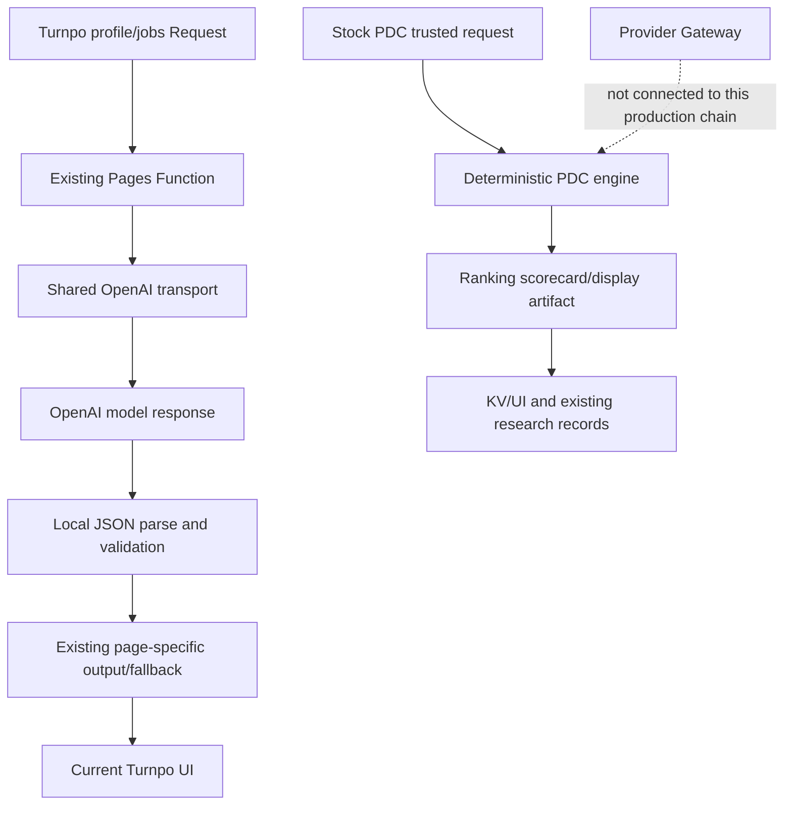
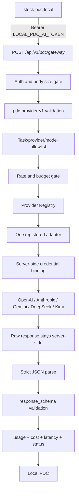

# Turnpo Provider Service Audit

审计日期：2026-08-15  
范围：Turnpo Pages Functions、现有 AI transport、Stock PDC 代码、Cloudflare Pages runtime binding、Provider Gateway 新实现。  
安全边界：没有读取、复制或输出任何 secret value；没有连接券商；没有发布交易结果；没有修改现有 Stock PDC 页面展示或 deterministic PDC 生产行为。

## 结论

当前仓库在本次施工前并没有一个可证明的五模型 Provider Registry：只有 OpenAI 在两个既有 Turnpo 功能中有真实 outbound transport；Claude、Gemini、DeepSeek、Kimi 只有文档/模型名单或 runtime secret binding，没有仓库内真实调用链。

本次新增了唯一的通用入口：

```text
POST /api/v1/pdc/gateway
```

它现在使用 `pdc-provider-v1`，只负责认证、契约验证、allowlist、预算/限流、adapter 调用、严格 JSON 校验、usage/cost/latency 记录。它不生成股票 prompt，不做候选筛选，不做 Round 1/2，不做匿名化、辩论、排序、BUY/WATCH/HOLD/SELL 判断，也不写 PDC/UI 生产数据。

当前 runtime 结论：

```text
LOCAL_PROVIDER_GATEWAY_PARTIALLY_READY
```

原因是代码与五个 provider 的 server-side credential references 已建立，但 Preview 没有 provider secret，生产没有被本次任务修改，生产模型 allowlist/真实 gateway smoke 尚未完成。因此不能标记 `READY_FOR_LOCAL_INTEGRATION`。

## 1. 当前五个模型调用审计

### 1.1 历史上已经存在的真实调用

| Provider | 文件位置 / 调用函数 | 输入 | 输出 | 使用模型 | 错误处理 | 成本记录 |
| --- | --- | --- | --- | --- | --- | --- |
| OpenAI | `functions/api/ai/_openai.js:10` `fetchOpenAiResponses`；由 `functions/api/ai/import-profile.js:onRequestPost` 和 `functions/api/jobs/search.js:searchProfileFromOpenAi` 调用 | Profile import 的 source text/profile context；Jobs 的 Turnpo Markdown profile | Responses API text，调用方随后 `JSON.parse` 并做本地字段归一化；Jobs 失败时回退 deterministic profile | Profile: `OPENAI_MODEL || gpt-4o-mini`；Jobs: `OPENAI_JOBS_MODEL || OPENAI_MODEL || gpt-4o-mini` | 缺 key；HTTP 非 2xx；AbortController timeout；空 output/invalid JSON；Jobs 有 deterministic fallback | 没有 token usage、单次 USD 或累计 AI cost 记录 |
| Claude | 未发现历史真实调用位置 | 无 | 无 | 无 | 无 | 无 |
| Gemini | 未发现历史真实调用位置 | 无 | 无 | 无 | 无 | 无 |
| DeepSeek | 未发现历史真实调用位置 | 无 | 无 | 无 | 无 | 无 |
| Kimi | 未发现历史真实调用位置 | 无 | 无 | 无 | 无 | 无 |

补充：`stock-pdc-engine` 中的五模型名单/回传校验不是 provider call。它不包含 API client、secret 读取、HTTP outbound 或模型响应生成。

### 1.2 本次 Provider Gateway 中的统一 adapter

这些是已写入仓库的 adapter 实现，不等同于已经完成真实 smoke：

| Provider ID | 文件 / 函数 | server-side credential reference | 上游请求 | adapter 输出 | 当前真实 outbound 证据 |
| --- | --- | --- | --- | --- | --- |
| `openai` | `functions/api/v1/pdc/_provider-adapters.js:executeOpenAi` | `OPENAI_API_KEY` | OpenAI Responses API，JSON Schema response format | `output_text` → Gateway parse/validate | 既有 profile/jobs 调用存在；新 Gateway smoke 未在 Preview 完成 |
| `anthropic` | `.../_provider-adapters.js:executeAnthropic` | `claude_api_pdc` | Anthropic Messages API，`output_config.format` | `content[].text` → Gateway parse/validate | 未验证 |
| `gemini` | `.../_provider-adapters.js:executeGemini` | `Gemini API Key pdc` | Gemini `generateContent`，JSON MIME/schema | `candidates[0].content.parts[].text` → Gateway parse/validate | 未验证 |
| `deepseek` | `.../_provider-adapters.js:executeDeepSeek` | `deepseek api pdc` | DeepSeek chat completions，JSON mode | `choices[0].message.content` → Gateway parse/validate | 未验证 |
| `kimi` | `.../_provider-adapters.js:executeKimi` | `kimi pdc` | Moonshot/Kimi chat completions，JSON mode | `choices[0].message.content` → Gateway parse/validate | 未验证 |

adapter 的共同接口是：

```text
execute({ model, system_instruction, payload, response_schema, timeout_ms })
  -> { provider_id, model_id, status, output, usage, cost, latency_ms }
```

`max_output_tokens` 是受服务端上限约束的可选预算参数；调用方不能传 provider secret、URL、Authorization header 或 fallback model。

请求格式参考 provider 官方文档： [Anthropic Messages API](https://platform.claude.com/docs/en/api/messages/create)、[Anthropic structured outputs](https://platform.claude.com/docs/en/build-with-claude/structured-outputs)、[Gemini structured output](https://ai.google.dev/gemini-api/docs/structured-output)、[DeepSeek JSON Output](https://api-docs.deepseek.com/guides/json_mode/)、[Kimi Chat Completions](https://platform.kimi.ai/docs/api/chat)。

## 2. Cloudflare runtime binding 审计

只记录 binding 名称与 presence 状态，不记录 secret value。

| Provider | Production credential | Preview credential | Production model allowlist | Preview model allowlist | 结论 |
| --- | --- | --- | --- | --- | --- |
| OpenAI | `OPENAI_API_KEY`: `PRESENT` | `MISSING` | 未验证；`OPENAI_MODEL` 是 secret binding，不当作 allowlist | `PDC_OPENAI_ALLOWED_MODELS=gpt-4o-mini` | Preview 不能真实调用 |
| Anthropic | `claude_api_pdc`: `PRESENT` | `MISSING` | `MISSING` | `MISSING` | 未启用 |
| Gemini | `Gemini API Key pdc`: `PRESENT` | `MISSING` | `MISSING` | `MISSING` | 未启用 |
| DeepSeek | `deepseek api pdc`: `PRESENT` | `MISSING` | `MISSING` | `MISSING` | 未启用 |
| Kimi | `kimi pdc`: `PRESENT` | `MISSING` | `MISSING` | `MISSING` | 未启用 |

Preview 已确认存在 `LOCAL_PDC_AI_TOKEN` 与 `STOCK_PDC_KV`；没有读取或复制 provider secret。上一轮 Preview deployment 的 fail-closed auth probe 通过，但因为没有 Preview provider credential，没有发起真实上游 provider request。

## 3. 当前 Provider Registry 判断

### 审计前

**没有 Provider Registry。** 原因：OpenAI transport、model fallback、prompt、timeout 分散在功能 Function 中；其他四个 provider 没有 adapter；没有统一 allowlist、health、budget、retry、usage/cost envelope。

### 本次实施后

仓库现在有：

- `functions/api/v1/pdc/_provider-registry.js`：五个 canonical IDs：`openai`、`anthropic`、`gemini`、`deepseek`、`kimi`；
- 每个 entry 的 `provider_id`、`enabled`、`credential_reference`、`allowed_models`、`adapter`、`timeout_ms`、`max_retries`、`health_status`；
- `providerRegistrySnapshot(env)`：只返回 metadata/presence，不返回 secret；
- `GET /api/v1/provider/health`：配置态 + operator attestation，不主动调用 provider。

注意：Registry 存在不等于 provider READY。只有 credential、allowlist、adapter 和真实 smoke/attestation 都具备时，health 才能标记 `READY`。

## 4. 当前流程

### 4.1 生产既有链路



### 4.2 新 Provider Gateway 链路



Turnpo 在这条链路中不插入投资 prompt、不生成 Frozen Facts、不做 ranking、不做交易决策。

## 5. Rankings / scorecard 现状

现有 Stock PDC ranking scorecard 仍由 `stock-pdc-engine` 的 deterministic logic 生成，随后进入既有 artifact/KV/UI 流程。新 Gateway 不读取、写入或替换该流程。

如果 local 需要股票 scorecard，local 负责提供 `system_instruction`、冻结 payload 和 `response_schema`。可使用已经存在的 `contracts/pdc-ai-scorecard-output-v1.schema.json` 作为严格 output schema；`contracts/pdc-ai-contract-v1.schema.json` 是 local PDC 的完整输入/输出语义文件，不是 Gateway 的业务编排器。

## 6. Provider Execution API v1

### Canonical endpoint

```text
POST /api/v1/pdc/gateway
```

没有新增一个等价的 `/api/v1/pdc/provider-execute`；现有 gateway 路由已被收敛为唯一通用入口。旧 `/api/v1/pdc/evaluate/shadow` 仅保留历史 PDC-specific compatibility path，不作为 local 新接口。

### Authentication

```http
Authorization: Bearer $LOCAL_PDC_AI_TOKEN
Content-Type: application/json
```

无 token 或错误 token 在 provider routing 前返回 `401 AUTH_FAILED`；没有 provider outbound call。Turnpo 不向 local 返回 provider API key，local 不保存 provider key。

### Request

```json
{
  "contract_version": "pdc-provider-v1",
  "request_id": "11111111-1111-4111-8111-111111111111",
  "run_id": "22222222-2222-4222-8222-222222222222",
  "provider_id": "openai",
  "model_id": "gpt-4o-mini",
  "task_type": "SCORE",
  "system_instruction": "Return only strict JSON matching response_schema.",
  "payload": { "caller_owned_frozen_facts": true },
  "response_schema": {
    "type": "object",
    "additionalProperties": false,
    "required": ["score"],
    "properties": { "score": { "type": "number", "minimum": 0, "maximum": 10 } }
  },
  "timeout_ms": 12000,
  "max_retries": 1,
  "budget": { "max_cost_usd": 1, "max_output_tokens": 2048 }
}
```

Required task types are only `SCORE`, `CHALLENGE`, `SMOKE`. Any old PDC task name such as `ranking_scorecard` is rejected with `TASK_NOT_ALLOWED`.

`response_schema` must be a strict object schema with `additionalProperties:false`; unsupported uncontrolled schema features are rejected. No output repair, markdown stripping, field filling or fabricated completion is performed.

### Response

Success:

```json
{
  "contract_version": "pdc-provider-v1",
  "request_id": "11111111-1111-4111-8111-111111111111",
  "run_id": "22222222-2222-4222-8222-222222222222",
  "provider_id": "openai",
  "model_id": "gpt-4o-mini",
  "task_type": "SCORE",
  "status": "SUCCESS",
  "output": {},
  "usage": { "input_tokens": 100, "output_tokens": 40, "total_tokens": 140, "retry_count": 0 },
  "cost": { "currency": "USD", "usd": "UNAVAILABLE", "pricing_status": "NOT_CONFIGURED", "tracking_status": "LOGGED_ONLY" },
  "latency_ms": 820,
  "error_code": "SUCCESS"
}
```

Failure uses the same envelope with `status:"FAIL"`, `output:"UNAVAILABLE"`; unavailable usage/cost/latency fields use the literal `UNAVAILABLE` rather than fabricated values.

### Failure codes

`AUTH_FAILED`, `PROVIDER_NOT_CONFIGURED`, `PROVIDER_DISABLED`, `MODEL_NOT_ALLOWED`, `TIMEOUT`, `RATE_LIMITED`, `BUDGET_BLOCKED`, `NETWORK_ERROR`, `PROVIDER_ERROR`, `INVALID_JSON`, `SCHEMA_FAILED`, `TASK_NOT_ALLOWED`, `INVALID_REQUEST`。

### Timeout/retry

- Request timeout is bounded to 1–30 seconds and capped by the Registry.
- `max_retries` is bounded to 1; only `429`、`5xx`、network errors are retryable.
- Authentication、model allowlist、invalid JSON、schema failure不会 retry。

### Budget/cost/logging

- Request budget supports `max_cost_usd` and `max_output_tokens`.
- Existing KV budget controls use `PDC_DAILY_TOTAL_BUDGET_USD`、`PDC_DAILY_PROVIDER_BUDGET_USD`、`PDC_RUN_BUDGET_USD`；KV is a best-effort soft safety counter, not exactly-once distributed accounting.
- Cost is calculated only when provider usage and server-side pricing configuration both exist；otherwise `usd:"UNAVAILABLE"`。
- Logs contain request/run/provider/model/task/timestamp/status/latency/retry/usage/cost；默认不记录 payload、system instruction、response schema、raw response 或 secret。

## 7. 安全设计

1. Local only receives `LOCAL_PDC_AI_TOKEN`; provider credential remains in Turnpo runtime binding.
2. Auth is checked before body routing, allowlist and upstream call.
3. Provider/model are canonical and allowlisted; no wildcard, arbitrary URL or fallback model.
4. Payload rejects secret-like field names and enforces size/depth limits.
5. Provider output is parsed as JSON and validated against caller schema. Narrative text, missing required fields and uncontrolled fields fail closed.
6. `SMOKE` requires exactly `{ "provider_test": true }` and the exact output `{ "provider_test": true, "score": 7 }`.
7. `OFFLINE_TEST` is the default and makes no provider call. Only explicit `REAL_SHADOW` permits outbound execution. `PRODUCTION` is not enabled by this gateway.
8. The gateway has no database/UI publish side effect and no brokerage/transaction integration.

## 8. Migration plan

1. Keep existing profile/jobs OpenAI calls and current Stock PDC deterministic flow unchanged.
2. Deploy the generic gateway to a dedicated Preview/Shadow environment only.
3. Configure one provider credential and one explicit model allowlist in that environment; never copy production keys into Preview.
4. Run one exact `SMOKE` request and record health attestation without logging raw output or secrets.
5. Add local PDC contract tests against `pdc-provider-v1`.
6. Enable additional providers one at a time after real smoke, pricing and model allowlist verification.
7. Production migration requires a separate approval; this task does not perform it.

## 9. Final assessment

| Question | Answer |
| --- | --- |
| Current five-model calls all exist? | No. Existing real outbound is OpenAI only; four new adapters are implemented but not live-verified. |
| Provider Registry exists now? | Yes, as code metadata and dynamic health snapshot; not all providers are enabled. |
| Can local PDC use the contract? | It can implement against the contract; current live Preview cannot complete a real call because provider credential/model readiness is missing. |
| Does this change current production PDC/UI? | No. Existing deterministic PDC, ranking, database/KV and page rendering were not connected to the new gateway. |
| Is this READY_FOR_LOCAL_INTEGRATION? | No. |

最终状态：

```text
DESIGN_COMPLETE_NOT_IMPLEMENTED
```

Runtime/provider status remains:

```text
LOCAL_PROVIDER_GATEWAY_PARTIALLY_READY
```
